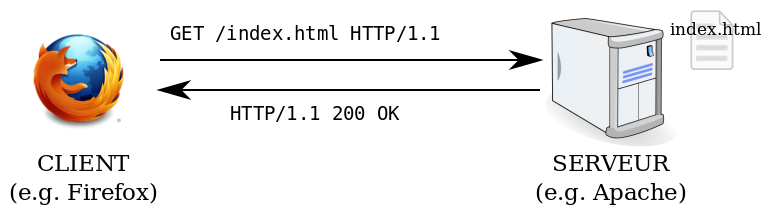

## HNU6054 – Humanités numériques : Web sémantique et données

# Introduction : architecture du web et web sémantique

Emmanuel Château-Dutier et Antoine Fauchié, mars 2022<br>
David Valentine, mai 2023, juin 2024

Site web pour les ressources du cours :  
[https://davvalent.github.io/hnu6054-3054/](https://davvalent.github.io/hnu6054-3054/)

???

- Accueil des participants
- Présentation de l'enseignant
- Conditions matérielles de la formation
  - matériel informatique
  - logiciels : éditeur et navigateur
  - Studium et site web
  - pauses
    - termine vers 11h15
    - pause vers 13h50
    - termine vers 15h20

===↓===

# Tour de table

- Nom
- Programme d’études
- Raisons et intérêts de recherche
- Cours et ateliers en humanités numériques

???

- Nom
- Programme d’études
- Raisons et intérêts de recherche
- Cours et ateliers en humanités numériques

===↓===

# Introduction

???

- Les technologies du web sémantique et l’approche du web de données liées, désignent une combinaison de techniques, d’outils et de standards qui permettent de transformer le world wide web d’un web de documents à un web de données.
- En appliquant cette approche au domaine des humanités numériques, à la recherche, mais aussi au monde des bibliothèques, des archives et des musées, les données liées permettre de redécouvrir en quelque sorte la manière dont on peut découvrir, analyser, et visualiser les contenus culturels et scientifiques sur le web.
- Donc les données ouvertes et liées (Linked Open Data, LOD)
  - permettent aux institutions patrimoniales et culturelles de publier et de partager des informations sur leur collections
  - permettent aux projets de recherche de diffuser des informations sur les objets de la recherche
  - en ouvrant de très large possibilités
    - de réutilisations
    - et d’enrichissements
    - et permet d’augmenter la visibilité des contenus.

Tout ça pose un certain nombre de défis pour les acteurs du monde culturel dans l’appropriation de ces technologies :

- bien sûr, l’adoption de ces technologies et de ces standards nécessite des compétences techniques particulières
- Mais partager les données des collections suppose d'abord l’adoption de politiques d’ouverture de données qui sont adaptées.
- Cette démarche présente également des enjeux relatifs à l’autorité des institutions. Dans un contexte distribué, où tout est lié à une échelle globale, on s'ouvre à des réseaux de données potentiellement très vastes, où chacun peut identifier, désigner et décrire à sa façon un objet culturel; donc des enjeux de rapport aux autorités.

Appréhender toutes ces choses.

===↓===

## La question des métadonnées dans le secteur culturel

???

Comme de nombreux secteurs d’activité numérique, le monde de l’édition est évidemment directement concerné par la question des métadonnées. Ces métadonnées désignent des informations descriptives sur les contenus qui peuvent être utilisées à de nombreuses fins dans un éco-système numérique :

- pour gérer des informations administratives sur les fichiers
- pour assister les processus de production
- pour participer à la diffusion des produits et à leur signalement dans des plateformes de diffusion
- pour personnaliser et recommander des produits aux utilisateurs
- pour collecter des données d’utilisation
- etc.

Dans les humanités numériques, on cherche plus souvent à décrire les objets de la recherche, qui peuvent être des documents, mais aussi des objets que l’on cherche à reconstituer à travers une représentation formelle. Par exemple, on pourrait décrire des bâtiments ou des objets muséaux afin d’utiliser ces représentations pour tenter de répondre à des questions de recherche, ou pour effectuer de la mise en valeur de contenus.

Les choix de structuration de données sont déterminés par l’exploitation visée. Autrement dit, ce sont les objectifs d’un projet de numérisation ou d’un projet de recherche qui déterminent ce qui doit être décrit, explicité, et discrétisé.

Beaucoup de projets numériques sont fondés sur l’utilisation de métadonnées. On recommande pour celles-ci l’emploi de format ouverts et interopérables, fondés sur des standards.

Par exemple, dans le monde de l’édition numérique, de nombreux modèles ont été développés et sont largement utilisés :

- Dublin Core
- modèles bibliographiques tels que MARC dans le monde des bibliothèques, Bibframe, etc.
- modèles spécialisés pour l’édition numérique académique comme la Text Encoding Initiative (TEI) ou JATS
- ONIX, un format développé spécifiquement par le secteur de l’édition numérique

Dublin Core est l’un des ces standards. Vous avez sans doute déjà eu l’occasion de le rencontrer dans d’autres cours, vous permet d’identifier ce que permet l’utilisation d’un modèle minimal de métadonnées générique (expressivité du modèle, enjeux relatifs aux formats de sérialisation, etc.). 

Ce n’est pas un standard du monde muséal à proprement parler, mais il est prévalent dans le domaine culturel et sert de pivot à l’interopérabilité sur le web.

Alors au cours de cet atelier, on va particulièrement nous intéresser à un ensemble de technologies promues et standardisées par le W3C (un organisme en charge de la standardisation du web) pour publier des données et assurer leur interopérabilité. Et on désigne globalement cet ensemble technologique sous l’appellation de **technologies du web sémantique**.

Nous parlerons également de données ouvertes et liées, ou Linked Open Data (LOD), pour désigner une manière d’utiliser la plateforme du word wide web afin de publier et de connecter ces données entre elles sur le réseau, sur le web.

===↓===

## Présentation du plan de cours

[https://davvalent.github.io/hnu6054-3054/plan-de-cours/](https://davvalent.github.io/hnu6054-3054/plan-de-cours/)

### Objectifs de la formation

### Programme des séances

### Présentation de l’évaluation

### Présentation des ressources

???

### Une introduction au web sémantique et au LOD

L’atelier constitue une première introduction au monde du web sémantique et au domaine des données ouvertes et liées. En si peu de temps nous ne ferons pas de vous des spécialistes, mais il s’agit d’acquérir une compréhension générale des enjeux posés par ces technologies et leurs applications possibles au domaine culturel. 

Ce faisant, il s’agit également de vous familiariser avec le monde des métadonnées culturelles et leur place centrale pour la découvrabilité des ressources dans l’écosystème numérique.

Enfin, nous vous proposerons une initiation à l’utilisation d’un langage de requête. SPARQL est un protocole et un langage destiné travailler avec des données dans le cadre du web sémantique.

J'aimerais qu'on démystifie ce domaine, souvent jugé compliqué, à tort ou à raison, mais qui présente une grande actualité au Québec et au Canada avec plusieurs projets d’ampleur. Comme vous vous en apercevrez, sa complexité ne tient sans doute pas tant aux aspects technologiques mais est plutôt liée à la conjonction d’aspect techniques et de domaines d’application métiers spécialisés.

### Nombreuses initiatives en cours dans le domaine culturel

?...

Fin 90, début 2000, principalement porté par TBL, mais qui décolle tranquillement... Ce projet n’a certainement pas connu le succès fulgurant qu’a rencontré le premier web qui existe depuis environ 35 ans.

~~Le projet du web sémantique et du web de données ouvertes et liées et un projet porté depuis le milieu de la première décennie des années 2000 par le fondateur du world wide web, Tim Berners Lee (cf. lecture). Solid, le projet sur lequel travaille actuellement Tim Berners Lee repose très largement sur l’application de ces technologies.~~

~~Toutefois, au terme de plus d’une décennie d’expérimentation, la promesse du web sémantique est loin d’être entièrement tenue.~~

Néanmoins, de nombreuses initiatives ont émergé ces dernières années, en particulier dans le domaine patrimonial et culturel, qui témoignent du très grand intérêt de ces approches, qui se sont affirmées comme une solution de choix pour le partage et l’échange d’information de qualité. Ces modèles présentent en effet une très grande expressivité qui permet de facilement bien rendre compte de réalités complexes et hétérogènes comme celles auxquelles on est souvent confrontés pour décrire des objets culturels.

Petit florilège de projets

- LODLAM Linked Open Data Libraries, Archives and Museums
- Research Space : Le rêve de l’historien de l’art rencontre ce que font actuellement les musées
- Mesure 131 Plan culturel numérique du Québec
- RCIP
- CIDOC CRM
- Peu d’application encore dans le monde de l’édition. Mais toutefois citer : Persée, Open Citation, etc.

===↓===

## Objectifs de l’atelier

**Initier les étudiantes et les étudiants aux principes du Web sémantique et des données ouvertes liées (Linked Open Data).**

**Objectifs spécifiques :** 

Au terme du cours, l’étudiante ou l’étudiant sera en mesure

- d’expliquer les principes du Web sémantique et du Linked Open Data
- de décrire des informations en ayant recours au cadre de description RDF (Resource Description Framework) et ses notations
- de réaliser des requêtes SPARQL simples
- d’identifier des applications du Web sémantique et du Web de données pertinentes dans le domaine de l’édition et de la culture

===↓===

## Démarche pédagogique

Le programme des séances est conçu selon un parcours progressif. Partant  d’une présentation générale de l’architecture du web et des enjeux relatifs à la production de données ouvertes et liées on envisage leur application au domaine culturel.

Le cours se déroule en trois séances intensives qui associent étroitement la théorie et son application à la pratique.

### Quels prérequis ?

- **aucun prérequis informatique** : simplement ne pas avoir peur !
- on va faire du code... mais plutôt que de programmation, il s’agira d’**enjeux de notation et de modélisation**. La difficulté concerne plutôt les connaissances métier et leur abstration.
- une initiation au langage de requête : complexe, mais abordé à partir de cas pratiques.

===↓===

## Séance 1 : lundi 10 juin 2024

- Architecture du web
- Principes du web sémantique et du Linked Open Data
- Applications du web sémantique au domaine culturel
- Le cadre de description <abbr title="Resource Description Framework">RDF</abbr> (si le temps le permet)

### Lectures

- Tim Berners Lee, James Hendler, et Ora Lassila. « The Semantic Web. » *The Scientific American,* 17 May 2001. http://www.scientificamerican.com/article.cfm?id=the-semantic-web [traduction française par Elisabeth Lacombe et Jo Link-Pezet, voir fichier]
- Jonathan Blaney. Introduction to the Principles of Linked Open Data. The Programming Historian. 2017. https://doi.org/10.46430/phen0068
- *The next web*. Réalisé par Tim Berners-Lee. 2019. https://www.ted.com/talks/tim_berners_lee_the_next_web/

???

À titre indicatif

===↓===

## Séance 2 : mercredi 12 juin 2024

- Le cadre de description <abbr title="Resource Description Framework">RDF</abbr> (suite)
- Présentation des exercices
- Ontologies et vocabulaires structurés
- TP RDFS

### Lectures

- RDF 1.1 Primer, W3C Working Group Note, 24 June 2014, http://www.w3.org/TR/rdf11-primer/

===↓===

## Séance 3 : vendredi 14 juin 2024

- Ontologies et vocabulaires structurés (suite)
- Le protocole et le langage de requête SPARQL
- Notation SPARQL
- TP Écriture de requêtes SPARQL
- Florilège d’applications du Linked Open Data
- Discussion

### Lectures

- Bob Ducharme. « Jumping Right In: Some Data and Some Queries. » Learning  SPARQL. Querying and Updating with SPARQL 1.1. 2e édition. O’Reilly, 2013
- Matthew Lincoln. Using SPARQL to access Linked Open Data. The Programming Historian. 2015. https://doi.org/10.46430/phen0047 **(retiré)**

===↓===

## Lectures et travail personnel 

Outre une bibliographie sommaire, plusieurs lectures sont proposées avec le cours. Ces références sont indiquées dans le plan de cours. Merci d’avoir lu et étudié ces publications avant les sessions afin de  pouvoir en discuter. À cet effet, il est recommandé de prendre des notes pendant vos lectures, et de les apporter en cours.

## Évaluations

1. Travail pratique (chez soi) exploration de DBpedia avec Sparnatural (40%)
1. Travail pratique (chez soi) sur l’analyse d'un projet et sur la production de requêtes (50%)
1. Participation et présence en classe (10%)

Comme l’atelier s’adresse à des novices, **c’est la participation aux exercices qui est principalement évaluée plus que les résultats**.

???

Recommandation pour la suite du cours

- ne pas hésiter à dire si vous êtes perdus
- sentez-vous **toujours** légitime de poser une question
- sentez-vous **toujours** légitime de ne pas comprendre
- c’est la participation qui est évaluée plutôt que les résultats = pas de stress

===↓===

## Sommaire

### 1. Le web de données liées et l’architecture du web

### 2. Principes du web sémantique et du Linked Open Data

### 3. Quelques applications au domaine culturel

### 4. Le cadre de description RDF

???

Depuis la publication de l’article de Tim Berners Lee (que vous aviez à lire pour aujourd’hui), le W3C et d’autres acteurs promeuvent un web sémantique et un espace informationnel lié sur le web dénommé *Linked Open Data*. 

Ce Linked Open Data prend une forme consistante dans plusieurs domaines et notamment dans le domaine culturel. Les technologies à la base de cet espace informationnel numérique sont celles du web sémantiques et reposent très largement sur le cadre de description RDF.

- Qu’est-ce que le Web sémantique ?
- Que recouvre la notion de Linked Open Data ?
- Quelles en sont les applications dans le domaine culturel ?

@todo revoir intro car redondante avec celle qui vient ensuite (pas si sûr...)

<!-- sep -->
===↓===

# 1. L’architecture du web

???

Avant d’aborder le cadre de description RDF et les principes du web sémantique, il me semble d’abord nécessaire de revenir avec vous sur l’architecture du web. En effet, les technologies du web sémantique et du web de données liées sont pour l’essentiel des applications de l’architecture du web. Il est donc important de bien avoir à l’esprit ses principes de conception généraux pour bien comprendre l’utilisation de ces technologies.

===↓===
<!-- .slide:
data-background-image="images/proposal.jpg" data-background-size="auto 100%"
-->

<!--  -->

[Tim Berners Lee, A Proposal, 1989.](https://www.w3.org/History/1989/proposal.html)

???

## Le projet initial du web

Origines dans le contexte du Centre d’étude et de recherche nucléaire (CERN) 

Tim Berners Lee. *A proposal*. 1989. http://info.cern.ch/Proposal.html = fête les 30 ans en 2019.

**Le rêve du web était de créer une plateforme de collaboration et de communication collaborative qui permette de partager de l’information en établissant un espace informationnel universel pour l’information et les services.**

- conçu comme une bibliothèque virtuelle
- un système de gestion de l’information pour partager des ressources informationnelles sur un réseau entre des chercheurs

Les ressources en ligne (*on line*) sont accessibles via une adresse unique, Uniform Resource Locator (URL). Ces documents peuvent être référencés entre eux via des liens hypertextuels.

Un WWW à la fois en lecture et en écriture : *A CRUD Web !* (CRUD *create*, *read*, *update*, *delete*).

## Caractéristiques

On détaille les implémentations plus bas...

- utilise TCP/IP (Transmission Control Protocol/Internet Protocol)
- utilise une manière d’identifier les resources 
- protocole d’échange
- hypertexte

## La notion d’hypertexte

Le web est basé sur la notion d'hyperetexte

- terme proposé par Ted Nelson dans le cadre du [projet Xanadu](https://www.xanadu.net/)
- décrit un texte non séquentiel qui comporte des embranchements et permet au lecteur de choisir son cheminement de lecture 
- à la différence du texte imprimé, il est destiné à être utilisé avec un dispositif interactif
- il est ouvert, fluide, mutable et peut être connecté à d’autres hypertextes par des « liens »
- hypermedia

===↓===

## Un réseau décentralisé


Paul Baran (1926-2011). « Centralized, Decentralized and Distributed networks » in On Distributed Communications. I. Introduction to distributed communications networks, Memorandum RM-3420-PR, août 1964. https://www.rand.org/content/dam/rand/pubs/research_memoranda/2006/RM3420.pdf

???

**Paul Baran** (1926-2011), RAND Corporation.

- *Paul Baran and the Origins of the Internet*. https://www.rand.org/about/history/baran.html
- Paul Baran (1926-2011). « Centralized, Decentralized and Distributed networks » in On Distributed Communications. I. Introduction to distributed communications networks, Memorandum RM-3420-PR, août 1964. https://www.rand.org/content/dam/rand/pubs/research_memoranda/2006/RM3420.pdf

La notion de réseau décentralisé jette les bases conceptuelles pour le développement du protocole de communication qui permet à Internet de fonctionner de manière décentralisée et interconnectée (vers TCP/IP).

===↓===

<!-- .slide: data-background="images/tim-vint-back.jpg" data-background-size="contain" -->

===↓===

<!-- .slide: data-background="images/tim-vint-front.jpg" data-background-size="contain" -->

## Internet ≠ le web

Tim Berners-Lee, Vint Cerf © W3C<!-- .element: style="background-color: rgba(217, 222, 222, 0.2);" -->

???

Tim Berners Lee, Vint Cerf © W3C

Internet n’est pas le web. Internet c'est :

- infrastructure
- un réseau de réseaux
- basé sur le protocole TCP/IP
- le web est une des applications d’internet : HTTP, HTML, navigateurs, etc.

(mails, transfert de fichiers, P2P, internet des objets, etc.)

===↓===

## Internet et le World wide web

| Fonctionnalités      | Dates | Concepteurs                       |
|----------------------|-------|-----------------------------------|
| Hypertexte           | 1968  | Ted Nelson                        |
| Internet             | 1978  | Vince Cerf & Robert Kahn          |
| World Wide Web       | 1990  | Tim Berners-Lee & Robert Cailliau |
| Navigateurs web      | 1993  | Marc Andreessen                   |
| Moteurs de recherche | 1998  | Sergey Brin & Larry Page          |

Couches fonctionnelles derrière les moteurs de recherche sur base de http://en.wikipedia.org/wiki/Web_search_engine

???

## Internet et le World wide web

L’omniprésence des moteurs de recherche nous fait parfois oublier qu’ils sont des outils relativement récents. Afin de comprendre leur fonctionnement, il est important de les examiner dans le contexte plus large de l’internet et du Web.

| Fonctionnalités      | Dates | Concepteurs                       |
|:-------------------|-----|---------------------------------|
| Hypertexte           | 1968  | Ted Nelson                        |
| Internet             | 1978  | Vince Cerf & Robert Kahn          |
| World Wide Web       | 1990  | Tim Berners-Lee & Robert Cailliau |
| Navigateurs web      | 1993  | Marc Andreessen                   |
| Moteurs de recherche | 1998  | Sergey Brin & Larry Page          |

Couches fonctionnelles derrière les moteurs de recherche sur base de http://en.wikipedia.org/wiki/Web_search_engine

Présentation chronologique même si l’articulation des différentes couches est plutôt fonctionnelle. Par exemple, si les développements théoriques concernant l’hypertexte datent de la fin des années 60, il se greffe d’un point de vue fonctionnel sur Internet avec le web.

Et donc il faut tout mettre ça ensemble pour comprendre comment fonctionne le genre de réseau qui nous intéresse.

===↓===

## La notion de réseau informatique

- Un **réseau local** est un réseau informatique se limitant à une pièce ou un bâtiment. Il est souvent composé de plusieurs ordinateurs ou périphériques reliés entre eux.
- Un **réseau étendu** est un réseau informatique couvrant une grande zone géographique qui peut s’étendre à la planète toute entière.

???

Donc tout ça pour créer des réseaux de machines par lesquels on échange de l'info.


===↓===

## L’architecture client/serveur

Les **machines clientes** faisant partie du réseau contactent un **serveur** qui leur fournit des **services**.

Principe : le serveur (ou service) attend l’arrivée des requêtes des programmes clients, puis il les traite.

Avantages : 

- ressources centralisées
- meilleure sécurité
- administration au niveau du serveur
- réseau évolutif

===↓===

## Les protocoles de communication

La notion de **protocole technique** : ensemble de spécifications qui définit la manière dont deux machines échangent des informations

**(dialogue entre les machines)**

### Distinguer

- ****protocole de transport**** des données d’un ordinateur à un autre
- ****protocole d’application**** qui détermine ce qu’il faut envoyer sur le réseau et comment exploiter les données reçues

===↓===

## **TCP/IP**, le protocole de transport

**TCP/IP** est un ensemble de protocoles utilisés pour le transfert des données sur internet (début des années 1980).

Un nom qui réfère à deux protocoles distincts :

- **TCP** Transmission Control Protocol
- **IP** Internet Protocol

Adoptés le 1er janvier 1983 par le réseau Arpanet

???

C'est vraiment l'élément fondamental d'Internet.

===↓===

## Internet

- **TCP/IP**, protocoles d’adressage et de transport
- **DNS**, système de noms de domaines

## Autres applications de l’internet

FTP, Imap, pop, SMTP, HTTP, P2P, VoIP (Voice over IP), etc.

### Protocoles

- **HTTP (HyperText Transfer Protocol)**
<br>protocole de transfert hypertexte pour naviguer sur le web (HTTPS pour la version sécurisée)
- **FTP (File Transfer Protocol)**
<br>protocole destiné au transfert de fichiers informatiques
- **SMTP (Simple Mail Transfer Protocol)**
<br>protocole utilisé pour transférer le courrier électronique vers les serveurs de messagerie
- **IMAP (Internet Message ac cess Protocol)** 
<br>protocole utilisé pour consulter son courrier électronique sur un serveur de messagerie

===↓===

## Le World Wide Web (www)

Destiné à mettre à disposition des ressources pour les partager. Un système où tout le monde peut publier.

**Une application de l’internet**

- HTTP HyperText Transfer Protocol une manière d’accéder aux ressources 
- URI pour désigner les ressources
- HTML information de représentation, Hypertexte pour naviguer entre des ressources
- Interprétation par les navigateurs

???

Plusieurs applications du réseau des réseaux. Courriels, transfère de fichiers, world wide web, téléphonie sur IP.

Web, destiné à mettre à disposition des ressources pour les partager.

Sous formeRéseau de communication décentralisé et non-hiérarchique basé sur une architecture client-serveur.

Rôle des protocoles. TCP/IP pour véhiculer l’ensemble de l’information = couche de transport et d’indentification. Wifi, etc.

Sur cette base, le World Wide Web est constitué de trois principaux composants :

- utilisation d’URI (Uniform Resource Identifier), pour identifier et adresser les ressources
- utilisation de HTTP (Hypertext Transfert Protocol), protocole de communication sur l’internet
- utilisation de HTML (HyperText Markup Language), langage de représentation de l’information et d’hypertexte

===↓===

## Ressources, représentations et identifiants

- Toute information pouvant être nommée peut être une **ressource**
- Une ressource peut recevoir plusieurs **représentations**
- Les ressources peuvent être **identifiées** sur le web.

*Axioms of Web Architecture: 3*, https://www.w3.org/DesignIssues/Generic

A Short History of "Resource" in web architecture. https://www.w3.org/DesignIssues/TermResource.html

???

La diapo correspond aux passages en gras.

> L’abstraction principale de l’information dans REST est la ressource. **Toute information pouvant être nommée peut être une ressource** : un document ou une image, un service temporel (par exemple «le temps d’aujourd’hui à Marseille»), une collection d’autres ressources, un objet réel (par exemple une personne), etc. En d’autres termes, tout concept pouvant être la cible d’une référence hypertexte d’un auteur doit entrer dans la définition d’une ressource. C’est une correspondance conceptuelle à un ensemble d’entités et ce n’est pas l’entité correspondant à cette association à un moment particulier dans le temps.

Une telle définition permet de généraliser de nombreuses sources d’information sans les distinguer ni par leur type ni par leur mise en œuvre. Ensuite elle permet de lier tardivement la référence et sa représentation. Enfin, elle permet de mettre en exergue un concept plutôt qu’une représentation donnée à ce concept.

Cela implique de donner un identifiant pour identifier des ressources impliquées dans une interaction entre composants. C’est l’autorité responsable de l’assignation d’un identifiant à la ressource qui est responsable du maintien de sa validité. C’est en ce sens que REST s’appuie plutôt sur les auteurs.

#### Les représentations

> Les composant REST effectue des actions sur une ressource en utilisant une représentation pour capturer l’état courant ou prévu de cette ressource et en transférant cette représentation entre composants.

Une représentation se compose de données et de métadonnées qui les décrivent. Le format de données d’une représentation est connu comme étant un type de média.

Puis identifiant prochaine diapo.

- Roy T. Fielding, _Architectural Styles and the Design of Network-based Software Architectures_, doctoral dissertation, University of California, Irvine, 2000. <https://www.ics.uci.edu/~fielding/pubs/dissertation/top.htm>
- Voir aussi https://datatracker.ietf.org/doc/html/rfc3986

===↓===

## IRI

Internationalized Resource Identifier (**IRI**), Uniform Resource Identifier (**URI**), Uniform Resource Locator (**URL**), Uniform Resource Name (**URN**), etc.

Les IRI et les URI sont des identifiants sur le web. Les URL identifient la ressource par le moyen d’y accéder.

### Schemes des IRI

`http://<host>/<path>?<search>#<fragment>`

- <scheme:chaîne/de.caractère>
- <http://monsite.com/dossier/fichier.html#ancre>
- <http://mondomaine.org/ressource/1234>

???

> The Internationalized Resource Identifier (IRI) is an internet protocol standard which builds on the Uniform Resource Identifier (URI) protocol by greatly expanding the set of permitted characters.

https://en.wikipedia.org/wiki/Internationalized_Resource_Identifier

===↓===

## Syntaxe des URI

```
foo://example.com:8042/over/there?name=ferret#nose
\_/   \_________/ \__/ \________/ \_________/ \__/
 |         |        |       |          |        |
scheme authority   port    path      query    fragment       
```

### Caractères réservés

- séparateurs : `:`, `/`, `?`, `#`, `[`, `]`, `@`
- sous-séparateurs : `!`, `$`, `&`, `'`, `(`, `)`, `*`, `+`, `,`, `;`, `=`

???

Les IRI sont des identifiants, ceux-ci peuvent être signifiants ou non.

Bonnes pratiques :

- Veiller à la persistance des différentes parties qui composent l’IRI
- Choisir un système de nommage extensible et pérenne
- Garantir l’unicité, en excluant toute ambiguïté

Plusieurs manière de gérer les identifiants :

- utilisation de systèmes normalisés (DOI, URN, ARK)
- utilisation d’IRI et mise en place de règles de gestion (une problématique d’organisation qui nécessite des processus et des moyens)
- prévoir les cas de disparition ou de fusion de ressources

===↓===

### Références

- **URL** – Uniform Resource Locator ([RFC1738](https://tools.ietf.org/html/rfc1738))
  - unique identification and location of resources
  - *mailto:emchateau@umontreal.ca*
- **URN** – Uniform Resource Name ([RFC2141](https://tools.ietf.org/html/rfc2141))
  - location-independent resource identifier
  - *urn:isbn:0-83891251-6*
- **URI** – Uniform Resource Identifier ([RFC3986](https://tools.ietf.org/html/rfc3986))
  - union of URLs and URNs
- **IRI** – Internationalized Resource Identifiers ([RFC3987](https://www.ietf.org/rfc/rfc3987))
  - non-ASCII chars don’t need to be encoded.
  - a sequence of characters from the
   Universal Character Set (Unicode/ISO 10646)

===↓===

## Hypertext Transfer Protocol **HTTP**

HTTP est un protocole pour le transfert de représentations d’un serveur à un client (HTTPs pour la version sécurisée)

- HTTP utilise TCP comme couche de transport, port par défaut 80 (443 pour HTTPs)
- HTTP standardise la manière dont un client envoie une requête à un serveur pour accéder à la représentation d’une ressource par l’intermédiaire de son URL
- HTTP standardise la manière dont un serveur répond avec une réponse qui peut contenir une représentation

### Méthodes

- GET - POST - CONNECT - PUT
- HEAD - OPTION - TRACE - DELETE

**La version la plus employée est HTTP 1.1 ([RFC2616](https://tools.ietf.org/html/rfc2616))**, depuis révisée par plusieurs documents [RFC7230](https://tools.ietf.org/html/rfc7230), [RFC7231](https://tools.ietf.org/html/rfc7231), [RFC7232](https://tools.ietf.org/html/rfc7232), [RFC7233](https://tools.ietf.org/html/rfc7233), [RFC7234](https://tools.ietf.org/html/rfc7234), [RFC7235](https://tools.ietf.org/html/rfc7235)

===↓===

## HTTP définit un nombre limité de méthodes

- [`GET`](https://tools.ietf.org/html/rfc7231#section-4.3.1) transfère une représentation
- [`HEAD`](https://tools.ietf.org/html/rfc7231#section-4.3.2) transfère seulement le statut et les entêtes
- [`POST`](https://tools.ietf.org/html/rfc7231#section-4.3.3) performe une opération spéciale à une ressource
- [`PUT`](https://tools.ietf.org/html/rfc7231#section-4.3.4) remplace ou crée une représentation
- [`DELETE`](https://tools.ietf.org/html/rfc7231#section-4.3.5) supprime une représentation

???

Attention : v.1.1!

> The request method token is the primary source of request semantics; it indicates the purpose for which the client has made this request and what is expected by the client as a successful result.

La méthode sert à indiquer au serveur la nature de la requête du client.

On considère qu’une méthode HTTP est [safe](https://tools.ietf.org/html/rfc7231#section-4.2.1) si elle est seulement en lecture. Le client ne demande pas alors de changement d’état de la ressource. GET et HEAD sont des méthodes sûres.

NB Ajouter des précisions sur l’hypermédia pour présentation plus avancées

===↓===

## Requêtes HTTP

Après avoir résolu l’adresse IP du serveur, le client envoie une requête HTTP

- **cette requête débute par une [ligne de requête](https://tools.ietf.org/html/rfc7230#section-3.1.1)**
  qui indique la méthode employée ([method](https://tools.ietf.org/html/rfc7231#section-4), le chemin d’URL de la requête ([request URL path](https://tools.ietf.org/html/rfc7230#section-5.5)), la version du protocole HTTP employé ([HTTP version](https://tools.ietf.org/html/rfc7230#section-2.6))
- **la requête peut contenir des [messages d’entêtes](https://tools.ietf.org/html/rfc7231#section-5)**
  précisant le serveur ([`Host`](https://tools.ietf.org/html/rfc7230#section-5.4)), les formats acceptés ([`Accept`](https://tools.ietf.org/html/rfc7231#section-5.3.2)), des précisions sur l’agent ([`User-Agent`](https://tools.ietf.org/html/rfc7231#section-5.5.3))
- si la méthode le permet, la requête peu contenir un corps ([body](https://tools.ietf.org/html/rfc7230#section-3.3))

===↓===

## Schéma d’une requête HTTP



===↓===

## Exemple de requête HTTP

pour obtenir l’adresse <https://en.wikipedia.org/wiki/Victor_Hugo>, le client se connecte à 91.198.174.192 avec TCP sur le port 80, et envoie la requête suivante :

```txt
GET /wiki/Victor_Hugo 
HTTP/1.1
Host: en.wikipedia.org
User-Agent: MyBrowser/1.0
Accept: text/html
```

???

La requête prend simplement la forme d’un message texte qui fournit un certain nombre d’annotation.

- La requête en indiquant une méthode et un URI, ici la méthode GET
- La version du protocole utilisé
- L’hôte
- Des détails sur le client
- Des annotations sur les formats demandés, la langue, etc.

===↓===

## Exemple de réponse HTTP

Pour notre [requête précédente](http://en.wikipedia.org/wiki/Victor_Hugo)

```txt
HTTP/2 200
date: Fri, 12 Mar 2021 21:07:01 GMT
server: mw1407.eqiad.wmnet
content-language: en
last-modified: Fri, 12 Mar 2021 19:23:11 GMT
content-type: text/html; charset=UTF-8
…

<!DOCTYPE html>
<html lang="en" dir="ltr" class="client-nojs">
…
```

???

Lorsque un serveur reçoit une requête, il génère une réponse

- **cette réponse débute par une ligne de statut ([status line](https://tools.ietf.org/html/rfc7230#section-3.1.2))**
  elle indique la version HTTP [HTTP version](https://tools.ietf.org/html/rfc7230#section-2.6), un code de statut [status code](https://tools.ietf.org/html/rfc7231#section-6), et une explication [reason phrase](https://tools.ietf.org/html/rfc7230#section-3.1.2)

- **la réponse peut contenir des messages d’entête ([header fields](https://tools.ietf.org/html/rfc7231#section-7))**

  comme le type de contenu [`Content-Type`](https://tools.ietf.org/html/rfc7231#section-3.1.1.5), ou la longueur du contenu [`Content-Length`](https://tools.ietf.org/html/rfc7230#section-3.3.2)

- **de façon optionnelle, la réponse peut contenir un corps**

  selon le code de statut ce corps de réponse peut contenir le contenu des documents

===↓===

## Codes de statut

HTTP rassemble ces codes en cinq catégories selon la manière dont les requêtes sont prises en charge

- [100–199](https://tools.ietf.org/html/rfc7231#section-6.2) *info* – le client peut continuer
- [200–299](https://tools.ietf.org/html/rfc7231#section-6.3) *success* – la requête a été comprise et acceptée
- [300–399](https://tools.ietf.org/html/rfc7231#section-6.4) *redirection* – une action supplémentaire est nécessaire
- [400–499](https://tools.ietf.org/html/rfc7231#section-6.5) *client error* – la requête n’a pas pu être complétée
- [500–599](https://tools.ietf.org/html/rfc7231#section-6.6) *server error* – le serveur n’a pas pu compléter la requête

### Exemples communs

- [200](https://tools.ietf.org/html/rfc7231#section-6.3.1) `OK` *(“default”)*
- [301](https://tools.ietf.org/html/rfc7231#section-6.4.2) `Moved Permanently`
- [303](https://tools.ietf.org/html/rfc7231#section-6.4.4) `See Other`
- [404](https://tools.ietf.org/html/rfc7231#section-6.5.4) `Not Found`
- [500](https://tools.ietf.org/html/rfc7231#section-6.6.1) `Internal Server Error`

???

En réalité requête plus haut, 301 pour https

Exemple dans un terminal avec le client cUrl

```bash
curl -I https://en.wikipedia.org/wiki/Victor_Hugo
```


===↓===

## La négociation de contenu

1. GET http://service/resource/example
<br>Accept: application/turtle
1. 303 See Other
<br>Location http://service/data/example
1. GET http://service/data/example
<br>Accept: application/turtle
1. 200 OK
<br>Representation :
<br>… @PREFIX ...

???

@todo faire image

- la négociation de contenu peut servir à diriger le client au bon endroit pour accéder à une représentation
- elle peut aussi servir à indiquer le type de contenu que le client attend

===↓===

## TP avec un client HTTP

Visitez l’adresse suivante avec un navigateur web :

http://dbpedia.org/resource/Victor_Hugo

- observez le contenu de la page
- observez le contenu de la barre d’adresse

Visitez la même adresse avec un client HTTP :

- [cURL](https://curl.haxx.se) est un outil en ligne de commande pour formuler des requêtes HTTP
- [ReqBin](https://reqbin.com/curl) est un client graphique web qui permet de formuler des requêtes HTTP

Essayer d’envoyer un message d’en-tête HTTP et observez le résultat

- `curl -H "Accept: application/rdf+xml" http://dbpedia.org/resource/Victor_Hugo`
- `curl -H "Accept: application/turtle" http://dbpedia.org/resource/Victor_Hugo`
- `curl -H "Accept: text/turtle" http://dbpedia.org/resource/Victor_Hugo`
- Tutoriel DBPedia : <http://wimmics.inria.fr/projects/semanticpedia/doc/index.php/Tutoriel_déréférencement_des_resources>
- Tutoriel Wikidata <https://gist.github.com/ColinMaudry/6fd6a5f610f0ac3e6696>

???

- L'URL a changé
- On accède à un document HTML : représentation

On peut observer la négociation de contenu dans la console du navigateur :

- 303 : vers page
- 303 : vers page avec https
- 200

En dehors de l’outil de ligne de commande cUrl, il est également possible d’utiliser l’outil ReqBin https://reqbin.com/curl

`curl -H "Accept: application/rdf+xml" http://dbpedia.org/resource/Victor_Hugo`

- application/rdf+xml
- application/turtle

<http://wimmics.inria.fr/projects/semanticpedia/doc/index.php/Tutoriel_déréférencement_des_resources>

- @todo revoir l’exercice
  - https://reqbin.com/curl s'occupe automatiquement de la négociation
  - code à copier-coller

===↓===

## **HTML** Hypertext Markup Language

HTML est un langage de balisage qui capture la structure du document

### HTML structure le contenu d’un document à l’aide de balises et d’éléments

- une balise ouvrant débute par `<` et se termine par `>`
- une balise fermante commence par `</` et se termine par `>`
- une balise auto-fermantes se terminent par `/>`

### un élément peuvt recevoir des attributs sous la forme de nom/valeur

- le nom de l’attribut est suivi par `=` et sa valeur
- la valeur est entourée de guillemets simples ou doubles

### HTML définit des hyperliens

Élément représentant un hyperlien :

`<a href="http://url.com">ancre de l’hyperlien</a>`

???

Ça nous mène vers une page HTML, qui un type de représentation.

### HTML se focalise sur la structure du document

Ce document est destiné à un navigateur (browser) tel que Firefox, Chrome ou Internet Explorer.

**Pas le seul format de représentation possible d’une ressource.** Dans le contexte du web sémantique, comme nous allons le voir d’autres formats de représentation sont possibles pour une ressource. Ces différents formats permettent :

- Produire des contenus destinés à d’autres types d’agents (programme informatique, etc.)
  - Ex. pour ceux qui ont suivi le cours sur TEI, représentation possible d’un texte en HTML, mais aussi en TEI, et même extraction MARC ou DC.
- Possibilité de construire des applications hypermédia, fondées sur REST
  - Ex application qui peuvent servir des fichiers JSON, ou des réponses XML
- Possibilité de traitement automatique

### Pour des présentations plus développées

ajouter un segment de HTML

Décrire un ensemble minimal de balise

Présenter l’association avec une feuille de style, les scripts

Dans une document HTML, on renvoie habituellement les informations de mise en page dans une CSS.

Contenus multimédias inclus

Formulaires

### Pour des présentations plus développées

Expliquer les notions de cache, proxy, etc.

HTTPs

HTTP2

===↓===

## **HTML** Hypertext Markup Language

HTML & XHTML (eXtensible hypertext markuplanguage)

- format de présentation
- langage informatique de description de contenu, dérivé de SGML (balises)
- hypertextualité

```html
<html>
	<head>
		<title>Titre de la page</title>
	</head>
	<body>
		<div>
			<h1>Titre du contenu</h1>
			<p>Lorem Ipsum et <a href="#pointer">un lien</a></p>
		</div>
	</body>
</html>
```

===↓===

## hypertexte / hypermédia

Architecture **REST**, pour Representational State Transfer.

- Roy T. Fielding, _Architectural Styles and the Design of Network-based Software Architectures_, doctoral dissertation, University of California, Irvine, 2000.
- Traduction Française du Chapitre 5 de la thèse de Roy T. Fielding http://opikanoba.org/tr/fielding/rest/

**REST se compose d’un ensemble de contraintes architecturales qui induisent des propriétés sur les architectures logicielles.**

- Architecture client-serveur
- Communication sans état
- Utilisation de cache
- Interface uniforme
- Système en couches
- Modèle de code à la demande

???

L’architecture du web définit un ensemble de contraintes qui peuvent être modélisées en identifiant les propriétés qu’elles induisent. À partir d’une telle modélisation, Roy Thomas Fielding a théorisé, dans sa thèse de doctorat, un paradigme de développement d’applications web qu’il nomme REST, pour Representational State Transfer.

**REST se compose d’un ensemble de contraintes architecturales qui induisent des propriétés sur les architectures logicielles.**

### Une architecture client-serveur

1° Une **architecture client-serveur** qui sépare les problématiques d’interface utilisateur de celle du stockage de données.

Cette contrainte améliore la portabilité de l’interface utilisateur sur les diverses plate-formes en permettant à ces deux composants d’évoluer indépendamment.

### Une communication dite sans état

2° Une **communication dite sans état**, c’est-à-dire dans laquelle chaque requête du client vers le serveur doit contenir toutes les informations nécessaires pour qu’elle puisse être comprise. Ainsi, cette requête ne peut utiliser aucun contexte stocké sur le serveur. L’état de la session est entièrement détenu par le client.

Cette contrainte facilite la visibilité de la requête, la fiabilité est améliorée car il est plus simple de faire face à des échecs. Enfin, il est plus facile de monter en charge car l’absence de stockage d’état entre les requêtes permet aux composants du serveur de libérer rapidement les ressources et la mise en œuvre est facilitée. L’inconvénient de cette contrainte est qu’elle peut diminuer les performances en nécessitant des interactions supplémentaires puisque l’information ne peut être conservée sur le serveur dans un contexte partagé. La gestion de l’état, côté client, réduit en outre le contrôle du serveur sur le comportement de l’application.

### L’utilisation possible de cache

3° **Utilisation d’un cache** pour améliorer les performances réseau. Cela impose que les données d’une réponse à une requête soient implicitement, ou explicitement, marquées comme pouvant être, ou non, mises en cache. Lorsqu’une réponse est mise en cache, le cache du client a la possibilité de réutiliser ces données pour les demandes ultérieures équivalentes.

Cette contrainte a l’avantage d’offir la possibilité d’éliminer certaines interactions et d’améliorer l’efficacité et la performance.

### Une interface uniforme

4° Une **interface uniforme** entre les composants est mise en place. Celle-ci implique quatre contraintes : l’identification des ressources, la manipulation des ressources par des représentations, des messages auto-descriptifs et l’hypermédia comme moteur de l’application.

Cette contrainte simplifie l’architecture globale du système et la visibilité des interactions. La mise en œuvre est découplée des services fournis ce qui favorise leur indépendance et les évolutions. Cependant, cela pénalise l’efficacité puisque l’information doit être transmise sous une forme normalisée plutôt que de manière spécifique aux besoins d’une application.

### Un système en couches

5° Un **système en couches** pour le déploiement d’une architecture à grande échelle comme le web. Le système est composé de couches hiérarchiques qui contraignent le comportement des composants puisque chaque composant ne peut pas voir au-delà de la couche intermédiaire avec laquelle il interagit.

Cette contrainte limite la complexité du système global et favorise l’indépendance des couches. Toutefois, l’utilisation d’intermédiaires ajoutent une latence supplémentaire et un surcoût dans le traitement des données.

### Modèle de code à la demande

6° Un modèle de **code à la demande** où le téléchargement et l’exécution de code sous forme d’applet ou de script permet l’extension des fonctionnalités d’un client.

Cette contrainte facultative simplifie les clients en réduisant le nombre de fonctionnalités qu’ils doivent mettre en œuvre par défaut. Elle améliore l’extensibilité du système.

### Les éléments architecturaux de REST

> Le modèle REST (Representation State Transfer) est une abstraction des éléments architecturaux d’un système réparti d’hypermédias." De ce fait, il est indépendant des détails de mise en œuvre de ces composants et de la syntaxe de protocole. Il se concentre sur le rôle des composants, les contraintes, sur leurs interactions, et leur interprétation des données. "Il englobe les contraintes fondamentales sur les composants, les connecteurs et les données qui définissent la base de l’architecture du Web, et ainsi l’essence de leur comportement en tant qu’application réseau.


===↓===

# 2. Principes du web sémantique et des données ouvertes et liées

???

- Article de *The Atlantic*
- [The Semantic Web](http://www.sciam.com/article.cfm?articleID=00048144-10D2-1C70-84A9809EC588EF21&catID=2) ([read it on the Internet Archive](http://wayback.archive.org/web/20070713230811/http://www.sciam.com/print_version.cfm?articleID=00048144-10D2-1C70-84A9809EC588EF21)), Scientific American, May 2001, Tim Berners-Lee, James Hendler and Ora Lassila.

Depuis la publication de l’article de Tim Berners Lee (que vous aviez à lire pour aujourd’hui), le W3C et d’autres acteurs promeuvent un web sémantique et un espace informationnel lié sur le web dénommé Linked Open Data (LOD) ou web de données ouvertes et liées.

Ce Linked Open Data (LOD) prend une forme consistante dans plusieurs domaines et notamment dans le domaine culturel. Les technologies à la base de cet espace informationnel numérique sont celles du web sémantique et reposent très largement sur le cadre de description RDF.

Avant d’aborder le cadre de description RDF, il est maintenant nécessaire de vous présenter le contexte général du Linked Open Data, en particulier dans le domaine culturel.

- Qu’est-ce que le Web sémantique ?
- Que recouvre la notion de Linked Open Data ?
- Quelle en sont les applications dans le domaine culturel ?

===↓===

## Qu’est-ce que le Web sémantique ?

> The **Semantic Web** provides a common framework that allows **data** to be shared and reused across application, enterprise, and community boundaries. It is a collaborative effort led by W3C with participation from a large number of researchers and industrial partners. It is based on the Resource Description Framework ( [RDF](https://www.w3.org/RDF/)).
>
> https://www.w3.org/2001/sw/

- 2001 [Semantic Web Activity](https://www.w3.org/2001/sw/)
- 2013 réunit au sein de la [W3C Data Activity](http://www.w3.org/2013/data/)

#### Principes

- Tim Berners-Lee, James Hendler et Ora Lassila. « The Semantic Web. » *Scientific American*, May 2001. <http://www.sciam.com/article.cfm?articleID=00048144-10D2-1C70-84A9809EC588EF21&catID=2>
- Tim Berners-Lee. Linked Data. 2009 [2006]. <http://www.w3.org:80/DesignIssues/LinkedData.html>

???

(Tel que le présente le W3C)

Le Web sémantique fournit **un cadre de travail commun** qui permet le partage et le réemploi de données à travers les frontières applications, entrepreneuriales ou communautaires. C’est un effort effort collaboratif porté par le W3C avec la participation de nombreux chercheurs et partenaires industriels. Il est basé sur le cadre de description RDF.

> The **Semantic Web** provides a common framework that allows **data** to be shared and reused across application, enterprise, and community boundaries. It is a collaborative effort led by W3C with participation from a large number of researchers and industrial partners. It is based on the Resource Description Framework ( [RDF](https://www.w3.org/RDF/)). See also the separate [FAQ](https://www.w3.org/2001/sw/SW-FAQ) for further information.
>
> https://www.w3.org/2001/sw/

**Le Web sémantique est un web de données.** Il concerne le partage de formats, l’intégration et la combinaison de données issues de sources diverses. C’est aussi **un ensemble de standards et de langages** destinés à documenter la manière dont les données sont en rapport avec les objets du monde réel. C’est **une infrastructure technique** qui permet à des personnes ou des machines d’accéder à des données connectées entre elles.

**La W3C Semantic Web Activity créée en 2001 pour développer le web comme un médium d’échange pour les données et les documents a été réunie en 2013 au sein de la [W3C Data Activity](http://www.w3.org/2013/data/) avec une portée plus large :** De plus en plus d’applications web fournissent en effet des moyens pour accéder aux données. En outre, des simples visualisations à des outils interactifs plus sophistiqués, de plus en plus d’applications reposent sur l’accès à des données d’origines diverses, parfois sans coordination préalable mais en utilisant des vocabulaires communs ou des modélisations communes. Cette activité du W3C est destinée à dépasser cette diversité pour faciliter l’intégration des données et leur traitement à l‘échelle du web en fournissant des formats standards, des modèles, des outils et des recommandations pour l‘échange de données. ([W3C Data Activity](http://www.w3.org/2013/data/))

> The overall vision of the Data Activity is that people and organizations should be able to share data as far as possible using their existing tools and working practices but in a way that enables others to derive and add value, and to utilize it in ways that suit them. Achieving that requires a focus not just on the interoperability of data but of communities.
>
> [W3C Data Activity](http://www.w3.org/2013/data/)

- Lie les activités d’[eGovernement](https://www.w3.org/2007/eGov/) avec celle du Web sémantique + Linked Open Vocabularies
- Lien avec les politiques d’Open data comme la [G8 Open Data Charter](https://www.gov.uk/government/publications/open-data-charter). L’[Executive Order](http://www.whitehouse.gov/blog/2013/05/09/landmark-steps-liberate-open-data) du Président Obama ou encore la [revised PSI Directive](http://ec.europa.eu/digital-agenda/en/legal-rules#revision-of-the-directive) de l’Union européenne.
- Plusieurs groupes de travail par domaine (échange de données, permissions, données spatiales, formats, web semantique, etc.). **Liens avec les activités Web des objets, mais aussi la [Digital Publishing Activity](https://www.w3.org/dpub/) et la [XML Activity](https://www.w3.org/XML/) (close en 2019).**

===↓===

<!-- .slide: data-background="images/webDeDonnees.png" data-background-size="contain" -->

## Web de document **vs** Web de données


???

## Qu’est-ce que le web sémantique

### Le projet initial du web

Le rêve du web était de créer une plateforme de collaboration et de communication collaborative qui permette de partager de l’information en établissant un espace informationnel universel pour l’information et les services.

cf. **A proposal**, un web CRUD (CREATE, READ, UPDATE, DELETE) !

Partage de documents par l’intermédiaire de l’hypertexte

### Web de documents vs Web de données

Là où le web classique avait été développé comme un web de documents, le web sémantique est un web de données.

- un web sur lequel ce ne sont plus les documents qui sont liés par des hyper liens mais l’information elle même qui est publiée et partagée de manière distribuée sur le réseau.

cf. [Tim Berners-Lee: The next Web of open, linked data](https://youtu.be/OM6XIICm_qo) 2009

===↓===

## Web de document

- mécanisme de communication (HTTP)
- mécanisme d’identification (IRI)
- encodage des messages (HTML)
- liens entre les documents (liens hypertextes dans HTML)
- clients pour interpréter le code (navigateur)

===↓===

## Web de données

- mécanisme de communication (HTTP)
- mécanisme d’identification (IRI)
- cadre de description (RDF)
- syntaxe (RDF/XML, N3, Turtle, RDFa, etc.)
- vocabulaires et grammaires (SKOS, RDFS, OWL)
- protocoles et langage de requête (SPARQL)

===↓===

<!-- .slide: data-background="images/silos.jpg" data-background-size="contain" -->

???

Le web de données propose des mécanismes pour pallier deux importants problèmes en lien avec l'idée des réseaux de données (réseaux sémantiques)

#### Le problème des silos

- bases de données seulement accessibles à travers des formulaires (exposition)
- problème d’interopérabilité des données (référentiels communs)

===↓===

<!-- .slide: data-background="images/semanticweb.jpg" data-background-size="contain" -->

???

#### Un problème sémantique

- polysémie
- multilinguisme
- cf. le triangle sémiotique (Ogden et Richard, révisé par Ulmann)
<br>https://www.universalis.fr/encyclopedie/triangle-semiotique/

Web sem fournit un mécanisme pour désambiguiser les descritptions de ressources sur le Web

===↓===

<!-- .slide: data-background="images/schema-evolution-web.png" data-background-size="contain" -->

## Les évolutions du Web

Radar Networks & Nova Spivack, 2007 – www.radarnetworks.com

???

L’idée d’un web sémantique peut être réinscrite dans une évolution plus générale du web.

- Web 1.0
- Web 2.0, un web participatif (en lecture et en écriture)
- Web 3.0, un web sémantique ou un web pour les machines

#### Une manière d’utiliser le web

Pas de rupture, mais plutôt un prolongement du web basé sur l’utilisation

#### Un web pour les machines ?

- de données structurées
- compréhensibles par les machines
- plusieurs applications communes (Rich Snippets de Google et [schema.org](https://schema.org/) (même si pas W3C))

Radar Networks & Nova Spivack, 2007 – www.radarnetworks.com

https://brunocecchini23.medium.com/the-worldwide-web-evolution-de82caaad8ea

===↓===

<!-- .slide: data-background="images/webEvolution.png" data-background-size="contain" -->

L’évolution du web. http://www.evolutionoftheweb.com

???


L’évolution du web. http://www.evolutionoftheweb.com

===↓===

## « Raw Data Now ! »

<iframe width="854" height="480" src="https://embed.ted.com/talks/tim_berners_lee_on_the_next_web" frameborder="0" allow="accelerometer; autoplay; clipboard-write; encrypted-media; gyroscope; picture-in-picture" allowfullscreen></iframe>

???

Conférence TED 13 mars 2009

> Il y a 20 ans, Tim Berners-Lee inventait le World Wide Web. Pour son nouveau projet, il construit un web des données, libres et liées, qui pourrait faire aux nombres ce que le web a fait pour les mots, les photos et les vidéos: libérons nos données et redéfinissons la manière dont nous les utilisons ensemble.
>
> 20 years ago, Tim Berners-Lee invented the World Wide Web. For his next project, he's building a web for open, linked data that could do for numbers what the Web did for words, pictures, video: unlock our data and reframe the way we use it together.

février 2009, The next web, conférence TED de Tim Berners-Lee https://www.ted.com/talks/tim_berners_lee_on_the_next_web

Demande partage de données brutes : « Raw Data Now ! »

Puissance des données collectées et stockées dans des bases de données pour répondre à des questions. Souligne importance des données et de leur réutilisation.

Principe du Linked Data

Chacun fait sa part, même petite, mais connecte ensemble des données. Pas question de quantités de données mais le fait de les connecter ensemble. Parallèle avec ce qu’avait précédemment fait avec le web de document.

https://www.ted.com/talks/tim_berners_lee_on_the_next_web?utm_campaign=tedspread&utm_medium=referral&utm_source=tedcomshare

https://www.ted.com/talks/tim_berners_lee_the_year_open_data_went_worldwide?utm_campaign=tedspread&utm_medium=referral&utm_source=tedcomshare

> A TED2009, Tim Berners-Lee a lancé un appel pour "des données brutes, maintenant" - afin que les gouvernements, les scientifiques et les institutions rendent leur données publiques sur internet. A l'université TED en 2010, il montre quelques-uns des résultats intéressants que l'on obtient en reliant les données.

Rapport avec les politiques d’open data

https://www.ted.com/talks/tim_berners_lee_the_year_open_data_went_worldwide?language=fr

7 juillet 2011, UK David Cameron announced the broadening of the publicly available government data with the publishing of key data on the National Health Service, schools, criminal courts and transport. http://data.gov.uk/data cf. https://www.gov.uk/government/news/pm-sets-ambitious-open-data-agenda

===↓===

## Données 5 étoiles


http://5stardata.info

???

Tim Berners-Lee, l’inventeur du web et l’initiateur du Linked Data a suggéré un déploiement en cinq étapes pour les données ouvertes (open data).

#### Plusieurs niveaux d’ouverture de données

- données accessibles sur le web
- données accessibles structurées (XSL, etc.)
- données structurées dans un format-non propriétaire (CSV, XML, etc.)
- Utilisation de URI pour identifier les ressources avec RDF
- Les données sont reliées à d’autres formats pour fournir du contexte

Tim Berners Lee. Linked Data. W3C, 2006. https://www.w3.org/DesignIssues/LinkedData.html

===↓===

## Données 5 étoiles

- ★ make your stuff available on the Web (whatever format) under an open license
- ★★ make it available as structured data (e.g., Excel instead of image scan of a table)
- ★★★ make it available in a non-proprietary open format (e.g., CSV instead of Excel)
- ★★★★ use URIs to denote things, so that people can point at your stuff
- ★★★★★ link your data to other data to provide context

Le site http://5stardata.info/en/ propose pour chacune des 5 étapes de l’ouverture des données des exemples et explique les coûts et les bénéfices qui les accompagnent. Les données utilisées pour les exemples sont issues de ‘*the temperature forecast for Galway, Ireland for the next 3 days*’.

===↓===

### Le concept de données liées ouvertes

???

### Le concept de données liées ouvertes

Une toile de données

- utiliser des adresses pour tout
- répondre avec des données descriptives
- inclure des liens vers d’autres données

===↓===

## Le Linked Open Data Cloud


http://lod-cloud.net

???

### L’ensemble des données liées forment le LOD Cloud

Évolution du LOD depuis 2007

- Schmachtenberg, Max, Christian Bizer, Schmachtenberg, et Heiko Paulheim. 2014. « State of the LOD Cloud ». State of the LOD Cloud. 2014. <http://linkeddatacatalog.dws.informatik.uni-mannheim.de/state/>.
- https://lod-cloud.net

LOD qui a débuté par un ensemble de données publiées entre elles : DBPedia qui a constitué le centre, Geonames, projet Gutenberg, bases de données bibliographiques, FOAF, Musique.

Ce nuage de données a connu une croissance considérable au point qu’aujourd’hui difficile à appréhender dans son ensemble. Il est dorénavant possible de les classer par domaine. Visualisation SVG qui permet d’afficher les liens entre les référentiels.

http://lod-cloud.net

http://data.dws.informatik.uni-mannheim.de/lodcloud/2014/

===↓===

## La pile des technologies du web sémantique


???

### Fondements technologiques du LOD

- Un **système d’identification fiable** et pérenne pour identifier les ressources (URI, IRI)
- Une **grammaire pour la description et des syntaxes** (RDF, RDF/XML, N3, Turtle, JSON-LD, etc.)
- des **ontologies** exprimées sous une forme compréhensible par les machines (SKOS, RDFs, OWL)
- un **protocole et un langage de requête** et de manipulation de données (SPARQL)

### La pile technologique du web sémantique

Voici une visualisation réunissant les différentes technologies du web sémantique et la manière dont elles s’articulent les unes avec les autres. Ce graphique est une version modifiée de la visualisation *Semantic Web technology stack visualization* créée par Benjamin Nowack. Il a particulièrement l’intérêt de mettre les standards technologiques en rapports avec les concepts et les abstractions auxquels ils répondent.

- Plateforme du web
- syntaxe / structure de représentation de la connaissance
- requêtes
- modèles sémantiques (ontologies, vocabulaires) + rules

===↓===

## Documents de références correspondants à ces différentes couches technologiques

- **The Web Platform** : [URI (Uniform Resource Identifier)](http://tools.ietf.org/html/rfc3986)/ [IRI (Internationalized Resource Identifier)](http://tools.ietf.org/html/rfc3987), [HTTP (HyperText Transfer Protocol)](http://tools.ietf.org/html/rfc2616) et [HTML (HyperText Markup Language)](http://www.w3.org/TR/html5/) qui ensemble fournissent la base du web hypertextuel ; [Linked Data](http://linkeddata-specs.info/)
- **Syntax** : [N3 (Notation 3)](http://www.w3.org/DesignIssues/Notation3)/ [Turtle (Terse RDF Triple Language)](https://www.w3.org/TR/turtle/), [RDFa](http://www.w3.org/TR/rdfa-core/), [XML (Extensible Markup Language)](http://www.w3.org/TR/xml/) et [JSON-LD (JavaScript Object Notation)](http://json-ld.org), [JSON-LD 1.1](https://w3c.github.io/json-ld-syntax/)
- **Knowledge Representation Structure** : [modèle RDF (Resource Description Framework)](http://www.w3.org/TR/rdf-concepts/) [RDF 1.1](https://www.w3.org/TR/rdf11-concepts/) ; [SKOS (a simple knowledge representation language)](https://www.w3.org/TR/skos-reference/)
- **Semantics** (advanced knowledge representation languages) : [RDFS (RDF Schema)](http://www.w3.org/TR/rdf-schema/), [OWL (Web Ontology Language)](http://www.w3.org/TR/owl2-overview/)
- **Protocol and query language**: [SPARQL](http://www.w3.org/TR/rdf-sparql-query/), [SPARQL 1.1](https://www.w3.org/TR/sparql11-overview/)
- **Rules** : [RIF (Rule Interchange Format)](http://www.w3.org/TR/rif-overview/)
- **Security** : [WebID](http://www.w3.org/2005/Incubator/webid/charter), [CORS (Cross-Origin Resource Sharing)](http://www.w3.org/TR/cors/)
- **Proof** : [Named Graphs](http://www.w3.org/2004/03/trix/Overview.html), [Provenance XG](http://www.w3.org/2005/Incubator/prov/XGR-prov/)
- **Trust** : [WebID](http://www.w3.org/2005/Incubator/webid/charter), [Provenance XG](http://www.w3.org/2005/Incubator/prov/XGR-prov/), [CORS (Cross-Origin Resource Sharing)](http://www.w3.org/TR/cors/)
- **Applications** : [Social Web](http://www.w3.org/2005/Incubator/socialweb/XGR-socialweb/), [LOD (Linked Open Data) Cloud](http://lod-cloud.net/)

cf. https://smiy.wordpress.com/2011/01/10/the-common-layered-semantic-web-technology-stack/

???

Voici une liste de liens pour accéder aux documents de références correspondants à ces différentes couches technologiques

===↓===

## Données liées en résumé :

- The Fitzwilliam Museum. Linked Open Data, what on earth is that? https://www.youtube.com/watch?v=mMR6JQ1M6qE
- The Fitzwilliam Museum. Linked Open Data: how does it work. https://www.youtube.com/watch?v=0m79yDb4AzE

===↓===

# 3. Quelques applications du web sémantique au domaine culturel

???

@todo

[Semantic Web Case Studies and Use Cases](https://www.w3.org/2001/sw/sweo/public/UseCases/)

===↓===

<iframe src="https://player.vimeo.com/video/49231111" width="854" height="480" frameborder="0" webkitallowfullscreen mozallowfullscreen allowfullscreen></iframe>
<p><a href="https://vimeo.com/49231111">Le web des donn&eacute;es ouvertes et li&eacute;es. Qu&#039;est-ce que c&#039;est ?</a> from <a href="https://vimeo.com/europeana">Europeana</a> on <a href="https://vimeo.com">Vimeo</a>.</p>

???

https://vimeo.com/49231111

===↓===

## Ouverture des données culturelles

- **2010**, publication de données d’autorités de la Bibliothèque nationale d’Allemagne (DNB) sous forme de données liées
- **14 juillet 2011**, ouverture de la British National Bibliography en CC-0
- **septembre 2011**, Conférence des Bibliothèques nationales européennes (CENL), vote en faveur licences libres CC-BY
- **octobre 2011**, [Library Linked Data Incubator Group final report](https://www.w3.org/2005/Incubator/lld/XGR-lld-20111025/)
- **2011**, Publication de l’[Europeana Data Model](https://pro.europeana.eu/page/linked-open-data)
- **octobre 2012**, [Publication de data.europeana.eu](https://pro.europeana.eu/page/linked-open-data)
- **février 2014**, [Getty research institute annonce publication AAT comme Linked Open data](http://blogs.getty.edu/iris/art-architecture-thesaurus-now-available-as-linked-open-data)

???

La perspective du web sémantique se rattache directement à celle de l’ouverture des données et au mouvement de l’Open data. Ainsi, dans le secteur culturel, les bibliothèques ont joué un rôle pionnier dans la publication de données liées.

Initiative Linked Open Data, Libraries, Archives and Museum **LODLAM !**

## Open Data

- février 2009, The next web, conférence TED de Tim Berners-Lee https://www.ted.com/talks/tim_berners_lee_on_the_next_web
- 7 juillet 2011, UK David Cameron announced the broadening of the publicly available government data with the publishing of key data on the National Health Service, schools, criminal courts and transport. http://data.gov.uk/data cf. https://www.gov.uk/government/news/pm-sets-ambitious-open-data-agenda

## Publication des métadonnées bibliographiques

- 2010, Bibliothèque nationale d’Allemagne (DNB), publication de données d’autorités comme données liées

- 14 juillet 2011, The British National Bibliography ouverture en CC-0, 2,8M de titres http://bnb.data.bl.uk

- septembre 2011, Conférence des Bibliothèques nationales européennes (CENL), 25e anniversaire, à la Bibliothèque royale du Danemark, Copenhague : vote d’un support pour l’utilisation de licence libre.

  > …the Conference of European National Librarians (CENL), has voted overwhelmingly to support the open licensing of their data. What does that mean in practice? It means that the datasets describing all the millions of books and texts ever published in Europe – the title, author, date, imprint, place of publication and so on, which exists in the vast library catalogues of Europe – will become increasingly accessible for anybody to re-use for whatever purpose they want. The first outcome of the open licence agreement is that the metadata provided by national libraries to Europeana.eu, Europe’s digital library, museum and archive, via the CENL service The European Library, will have a Creative Commons Universal Public Domain Dedication, or CC0 licence. This metadata relates to millions of digitised texts and images coming into Europeana from initiatives that include Google’s mass digitisations of books in the national libraries of the Netherlands and Austria. ….it will mean that vast quantities of trustworthy data are available for Linked Open Data developments.
  > https://app.e2ma.net/app/view:CampaignPublic/id:1403149.7214447972/rid:48e64615892ac6adde9a4066e88c736c

  décision qui faisait suite à la publication d’une représentation de MARC21 en RDF <https://www.jiscmail.ac.uk/cgi-bin/webadmin?A2=DC-RDA;d4041fb1.1109>  

  et de la publication du Europeana Data Model en 2011. cf. http://dataliberate.com/2011/09/29/will-europes-national-libraries-open-data-in-an-open-way

- 25 octobre 2011, Library Linked Data Incubator Group Final Report, https://www.w3.org/2005/Incubator/lld/XGR-lld-20111025/

- Octobre 2011, DC2011 présentation du pilote data.europeana.eu http://dcevents.dublincore.org/index.php/IntConf/dc-2011/paper/view/55

- septembre 2011, Bibliothèque nationale de Suède, ouverture de ses données d’autorité avec la licence CC-0 http://librisbloggen.kb.se/2011/09/21/swedish-national-bibliography-and-authority-data-released-with-open-license/

- 30 décembre 2011. Stanford Linked Data Workshop Technology Plan. http://dataliberate.com/wp-content/uploads/2012/01/LDWTechDraft_ver1.0final_111230.pdf

- 2011, Bibliothèque nationale d’Allemagne (DNB), extension de l’ouverture de ses données aux titres et adoption de la licence CC-0. cf. https://openglam.org/2012/02/09/191/

- février 2012, Denny Vrandecic annonce dans sa présentation à la Semantic Technology Conférence de Berlin qu’il rejoindra le projet Wikidata de la Wikimedia fondation. http://semtechbizberlin2012.semanticweb.com http://dataliberate.com/2012/02/07/wikidata-announcing-wikipedias-next-big-thing/

- 17 février 2012 Europeana annonce CC-0 <https://web.archive.org/web/20121011042824/http://pro.europeana.eu/web/guest/press-release?p_p_id=itemsindexportlet_WAR_europeanaportlet_INSTANCE_8k5F&p_p_lifecycle=1&p_p_state=normal&p_p_mode=view&p_p_col_id=column-2&p_p_col_pos=1&p_p_col_count=2&_itemsindexportlet_WAR_europeanaportlet_INSTANCE_8k5F_itemId=994900&_itemsindexportlet_WAR_europeanaportlet_INSTANCE_8k5F_javax.portlet.action=setItemId>

- Octobre 2012, Publication de data.europeana.eu https://pro.europeana.eu/page/linked-open-data

- février 2014, Getty research institute annonce publication AAT comme Linked Open data http://blogs.getty.edu/iris/art-architecture-thesaurus-now-available-as-linked-open-data

- mai 2015, Enhancing the Europeana Data Model (EDM). Europeana V3.0 https://pro.europeana.eu/files/Europeana_Professional/Publications/EDM_WhitePaper_17062015.pdf

- 2015, Unlocking The Value. The British Library’s Collection Metadata Strategy, 2015-2018 http://www.bl.uk/bibliographic/pdfs/british-library-collection-metadata-strategy-2015-2018.pdf

===↓===

## Exemples dans le monde de l’édition

- Contributor Role Ontology
  http://www.obofoundry.org/ontology/cro.html
- Semantic Publishing and Referencing Ontologies, a.k.a. SPAR Ontologies
  http://www.sparontologies.net
- BibFrame 2
  http://id.loc.gov/ontologies/bibframe.html
- FRAD model
  http://metadataregistry.org/schema/show/id/24.html
- GND ontology
  https://d-nb.info/standards/elementset/gnd#
- DNB Metadata Terms
  https://d-nb.info/standards/elementset/dnb

???

Contributor Role Ontology
http://www.obofoundry.org/ontology/cro.html

A classification of the diverse roles performed in the work leading to a published research output in the sciences. Its purpose to provide transparency in contributions to scholarly published work, to enable improved systems of attribution, credit, and accountability.

The Contributor Role Ontology expands the CASRAI Contributor Roles Taxonomy (CRediT), which is a high-level classification of the diverse roles performed in the work leading to a published research output in the sciences. Its purpose to provide transparency in contributions to scholarly published work, to enable improved systems of attribution, credit, and accountability.

===↓===

## Exemples d’applications

- DataBnf
  https://data.bnf.fr
- BibSonomy
  https://www.bibsonomy.org
- OpenCitations
  http://opencitations.net
- Isidore Science
  https://isidore.science

===↓===

## Grands référentiels en art

- [CIDOC-CRM](http://www.cidoc-crm.org)
- [Thesaurus du Getty Research Institute](http://www.getty.edu/research/tools/vocabularies/lod/)
- [Thesaurus MCC Fr](http://data.culture.fr/thesaurus/)
- [IconClass](http://iconclass.com)

???

https://iconclassblog.com

exemple :

Paper presented  at the annual CIDOC 2017 conference, September 25-30, Tbilisi, Georgia Both Iconclass and AAT are widely used multilingual systems to describe and annotate works of art and the content and scope of AAT and Iconclass differ noticeably, but also know overlap.

https://iconclassblog.com/2018/01/09/enriching-iconclass-lod-by-linking-keywords-to-aat-concepts/

===↓===

## Web de données culturel, l’exemple du domaine muséal

- Amsterdam Museum https://hart.amsterdam/nl/page/12686/amsterdam-museum-en-linked-open-data
- British Museum https://collection.britishmuseum.org/resource/About
- British Museum & Research Space http://www.researchspace.org
- American Art Collaboratory (AAC) et Linked Art http://americanartcollaborative.org, https://linked.art
- Musée du Prado https://www.museodelprado.es/en/modelo-semantico-digital/modelo-ontologico

???

- CPV Centre Georges Pompidou Virtuel (mais par LOD)
- Rijks Museum
- Museum Amsterdam
- EDM

#### Claros

http://www.clarosnet.org

"Claros, A virtual art collection" qui lie ensemble les galleries en ligne de six musées issus de différents pays européen.

Lancement de Claros en mai 2011, Wolfson College Oxford

Recherche interdisciplinaire, et interinstitutionnelle. Amener l’art classique à un public global.

Donna Kurtz et Sebastian Rahtz, cf. lancement http://podcasts.ox.ac.uk/claros-virtual-art-collection

> Built on the art of ancient Greece and Rome, CLAROS is an international research collaboration, using the latest Information and Communication Technologies to enable simultaneous searching of major collections in university research institutes and museums.

- nombreux collaborateurs internationaux
- agrégation de données hétérogènes, démonstrateur
- hébergé par le [University of Oxford's e-research centre](http://www.oerc.ox.ac.uk/)

https://clarosdata.wordpress.com/about/

Service de donné qui offre une interface REST aux données du projet et qui est complété par une interface de navigation CLAROS Explorer.

Le service fournit des métadonnées sur les objets d’art et les artefacts archéologiques dans différents formats de données comme RDF, JSON et KML.

Les données ont été modélisées en utilisant la représentation RDF du modèle conceptuel de référence CIDOC.

Les données sont aussi accessibles à travers un SPARQL Endpoint élaboré avec Fuseki et Humfrey (a RESTful web framework for displaying data from SPARQL endpoints).

Les objets peuvent être

- recherchés selon plusieurs facettes
- visualisés sous forme de géolocalisation sur une carte
- visualisés dans une chronologie
- liens vers les collections

===↓===

## Quelques exemples d’application

- WikiData, DBPedia
  https://www.wikidata.org, https://wiki.dbpedia.org
- Discovery Hub
  http://discoveryhub.co
- .Wasabi, Web Audio Semantic Aggregated in the Browser for Indexation
  https://www.ircam.fr/project/detail/wasabi/
- doremus
  https://github.com/DOREMUS-ANR

???

e

===↓===

### Pleiades

http://pleiades.stoa.org

### Pelagios Annotations

http://commons.pelagios.org

### Perio.do

http://perio.do

???

Bénéfices du Web sémantique

> CLAROS is work in progress, with more data partners to come, and large amounts of work to be done on both internal linking, and linking to the wider semantic web. The first fruit of this will be completion of work to join up the places inside CLAROS with those in geonames (<http://www.geonames.org/>) and Pleiades
> (<http://pleiades.stoa.org/>).

### Pleiades

Gazettier international sur les lieux géographiques financé entre 2000 et 2008 par Ross Scaife et le Stoa Consortium. Et nombreuses contributions par la suite.

### Pelagios, Linking the places of our Past

http://commons.pelagios.org

Fournit des ressources en ligne et un forum communautaire pour l’emploi et l’utilisation de méthodes de données ouverte pour lier et explorer des lieux historiques.

Projet financé par l’Andrew W. Mellon Foundation.

Idée d’une infrastructure décentralisée

- [Recogito](http://recogito.pelagios.org) outils pour facilement identifier des enregistrement et exporter des lieux géographiques dans des cartes
- [Peripleo](http://peripleo.pelagios.org) un service de recherche pour trouver des contenus
- [Pelagios Map Tiles](http://commons.pelagios.org/2012/09/a-digital-map-of-the-roman-empire/) un ensemble de resources pour projected les données sur des cartes dynamiques historiques

Et Groupes de travail

### Perio.do

http://perio.do

Un gazetteer de définitions de périodes pour le liage et la visualisation de données.

Réconcilier des données chronologiques.

===↓===

## Les prototypes de l’IRI

#### HDALab

http://hdalab.iri-research.org/hdalab

#### JocondeLab

http://jocondelab.iri-research.org/jocondelab

#### Iconolab

https://iconolab.iri-research.org

???

### Institut de Recherche et d’Innovation (IRI)

Dirigé par le philosophe des technique Bernard Stiegler.

Séminaire de muséologie numérique, réalisation de plusieurs prototypes en données liées.

### HDALab

http://hdalab.iri-research.org/hdalab

Le portail HDALab donne accès à plus de 5 000 ressources du portail Histoire des arts du MCC en France. Le projet publié en 2015 est issu d’une première expérimentation engagée en 2012 en partenariat avec l’IRI.

Le prototype portait sur la réalisation d’une interface de recherche et de navigation destinée à montrer le potentiel du tagging sémantique.
Histoire des arts’ Lab s’appuie sur une sémantisation (production de tags sémantiques) du corpus du Portail Histoire des Arts qui contenait plus de 5 000 notices descriptives de ressources en ligne produites par plus de 350 institutions culturelles dans toute la France  dans le contexte de la généralisation de l’enseignement de l’histoire des arts à l’École.

http://hdalab.iri-research.org/hdalab/hdalab/a_propos/

Montrer la vidéo de Renkan

La plateforme propose différents modules (géographique, temporel, thématique…), qui sont autant de dimensions pour multiplier les points d’accès et de recherche sur les contenus de la plateforme.

Dimension socio-sémantique et expérimentation d’une curation collaborative des ressources.

### JocondeLab

http://jocondelab.iri-research.org/jocondelab

Réalisé en collaboration avec l’Office de la francophonie. Traduction multilingue de l’interface et enrichissement des contenus.

Joconde Lab, projet mèné depuis en 2013. Projet qui fait suite au partenariat stratégique avec Wikipedia France et sémantique média et INRIA dans l'idée d'une politique culturelle de l'accès.

Une politique qui remonte à André Maleaux, ne peut se contenter d'être fournisseur d'accès, il faut cultiver l'accès.

Délégation à la langue française. Multilinguisme. Les œuvres qui portent les langues et non pas les langues qui portent les œuvres. Chacun peut leur donner un sens, ouvrent toutes fenêtre sur l'universel. Il importe donc de faire rayonner les œuvres de l'esprit et les œuvres culturelles. Au nom même du pluralisme culturel que défendons la langue française. Quoi de mieux pour promouvoir cette diversité culturelle que de diffuser des œuvres...

Plateforme en 14 langues, ouverte à tous les locuteurs. La première fois que l'administration offre une telle diversité linguistique sur la toile. Ouverture à des langues plus éloignées de nous, chinois, pays émergea tes, etc.
Proposons également de naviguer en quatre langues régionales.

Termes de la base Joconde alignés avec la base Wikipedia à partir de DBpedia. Réutiliser des contenus textuels et multimédias. Des lors que le travail d'alignement, de liage à été fait. Des lors plus nécessaire d'avoir recours à la traduction pour offrir un accès multilingue au contenu. Seuls les éléments de l'interface sont à traduire.

Facteurs humains. Ce travail n'aurait pas été possibles sans la mobilisation de différents services du MCC DLF, direction des musées de France. Sous direction des systèmes d'information qui a su proposer un cadre souple. Le département des services numériques qui a su transmettre expérience HDAlab.

Une expérimentation qui n'a aucunement vocation à. Remplacer la base Joconde mais démontre à quel point les technologies du web sémantique peuvent être utiles pour la mise à disposition du patrimoine en ligne notamment du oint de vue du plurilinguisme. Espérons que puisse servir d'exemple à titre méthodologique, technologique, etc.

Service musées de France
Ne remplace pas base des musées de France.
Des peintures conservées dans les musées de France Élargissement champ à ensemble des collections
Pas seulement 500 000 notices dont 300 000 illustrées, mais aussi pleinement devenue un outil de diffusion culturel à l'intention du grand public.

52 millions d'interrogation
Majorité des requêtes issues de pays francophone. La langue constitue donc bien un frein à la consultation des collections. Mais assurer la traduction en plusieurs langues d'une base de données en constante évolution pas les moyens. Ici tester l'intérêt d'une traduction dynamique.

Objets des collections publiques qui témoignent de l'évolution universelle. Renforcer synergie avec Wikipedia

#### Iconolab

https://iconolab.iri-research.org

Possibilité annoter fragment, fonctionnalités collaboratives. Évaluations contributions selon les critères de pertinence et de fiabilité.

### IRI

Travail sur la capacité à caractériser les contenus des amateurs. Convergence entre cette capacité propre au ministère de la culture et de la confronter à celle des utilisateurs. Discussion catégorielle qui constitue un des programmes de recherche de l'IRI autour des Digital Studies. Opiniâtreté de Bertrand Sajus et Alexandre Monin à démontrer que le moment était venu.

Colloque 6 et 7 février résultat ANR
Enjeux de valeurs sur les contenus

Travail sur les catégories de Wikipedia pour les faire remonter dans l'interface et fournir des facettes.
Une chronologie, interface temporelle = manière très intuitive de naviguer dans la base. Aspect de serendipité que cherche à mettre en place. Geotagging des œuvres. Rapidité du développement car les données déjà targuées.

Important de voir la manière dont les données agrégées, en fait parti de la Bretagne, et grâce à Wikipedia que détermine la période chronologique. Ou dynastie Tang...

Prototype qui tire parti de Wikipedia pour traduire toutes les entrées quand disponibles dans Wikipedia. Permet de se balader dans toutes les langues : à partir d'une donnée française à pu aller chercher les données dans toutes les langues dès lors qu'étaient disponibles.

Exemple : Saint-Jean-pied de porc

Un premier pas vers quelque chose de plus technique à l'avenir. Notamment si veut offrir un accès par login pour constituer des dossiers personnels.

Intéressant y de voir que contributeurs peuvent ajouter des mots clefs qui n'existent pas dans le référentiel : exemple der des ders pour la 1ère guerre.

Propose aussi un tri aléatoire, en proposant aux gens de targuer les contenus. Proposer des chantiers aux utilisateurs et profiter de ces événements pour éditorialiser la collection.

Une interface développée en multi-terminal, une exigence du ministère pour les utilisateurs de tablettes.

===↓===

### BBC

http://www.bbc.co.uk/things/

???

Historique ancien de la BBC

- Télédiffuseur depuis les années 30
- Sur internet dès les années 1994
- Découverte par les ingénieurs et équipes de développement en 2004 *web domain driven design*
  - Chaque chose une URI, une URI par choses
  - Alors peut avoir des vues de données de type RDF/XML

Mais tout n’était pas rose dans ce monde...

- Ouverture de toutes les données dans des vocabulaires utilisables par tous. 
  --> Alors google va prendre nos données mais eux des milliards pour les arranger de manière pertinente. 
  --> Risque de rendre nos données irrelevantes.
- Peur de la perte de contrôle qui a constitué un gros frein face aux véléités d’ouverture des données.

Beaucoup eu d'expérimentation, mais peu d’innovation. Car nombreuses de données dans nos placards pas libre de droits. Agréments avec agences météos, sports, etc. Souvent peu clairs pour l’ouverture des données. S’est donc dit qu’aller être flou en matière de licence. Des expérimentations, mais quand nécessite évolution avec investissement et startup, plus personnes.

Se sont donc retournés vers leurs principes : Le Web est notre CMS, chaque URI une chose, etc. Qu’en faire ?

Un des succès pragmatique dont parlait peu. BBC avait fait des choses à partir de données ouvertes dont disposait et qui marchait très bien. Des données sur qui était passé à la radio et quand, etc. Mais pas de connaissance nécessairement fine sur ces personnes. Pouvait pour ça faire référence à d'autres données ouvertes telles que Wikipedia.

Deux avantages à cela. Utiliser des données ouverte permet de disposer d'identifiants. Mais également des environnements et nous permet de nous intégrer à tout cela. Peut participer à la base Wikipedia.
En tant qu'utilisateur de LOD cela a plutôt bien fonctionné.

Depuis 2009 beaucoup aussi utilisé le LOD en interne. Linked data plateform pour construire des sites web. Nous a permis de passer d'un système ou chacun faisait son truc dans son coin à la mise en commun efficace sans avoir à tout refaire depuis le début. Se contenter ajouter petits tags, pour permettre ensuite de récupérer ensemble sans avoir à changer la plateforme de publication.

Aujourd'hui en train de le faire  de manière pilote sur des informations de lieux pour produire de l'information locale à bas coût. Mais aussi des stories au sens de développement narratif des histoires. Interressant pour nous que l'utilisation assez simple de LOD permet de passer d'une information très répétitive et pauvre en elle-même à une information qui s'intègre dans une trame narrative, à faire du sens.

Travail avec le Gardian pour développer une ontologie pour voir comment cette série d'événements peuvent faire une histoire, faire l'Histoire avec un grand H.

Pour BBC world service, travail sur l’extraction de sujet et correction par les humains.
Venus nous voir il y a deux ou trois ans avec quelques téra octets de diffusion. Trois ans d'écoute ! Une belle archive, mais les métadonnées horribles.

Dans ces cas là que faire ?
Une solution qui marche les stagiaires !
Mais si faisait quelque chose de plus flexible et réutilisable que le stagiaire. Démultiplier le stagiaire : un algorithme ! Qui allait probablement faire  mieux qu'un stagiaire... Utilisation d.un logiciel de reconnaissance vocale. = transcription de programmes plus ou moins utilisable. Ne dit pas que compréhensible, mais des mots, et d'après la fréquence des termes, possibilité d'extraire des éléments d'indexation avec une certitude plus ou moins grande.

Revient alors à l'humain qui va maintenant nous aider à vérifier. Ouverture de cette archive au l'onde en permettant de contribuer. D'abord à ouvert à des fans un outil pour localiser les plages d'écoutes par speakers. Plusieurs sujets extraits. Demande aux auditeurs de nous confirmer cette extraction de sujets.
Idéalement se retrouve avec un cercle vertueux. Auditeurs nous aide et peut faire en sorte que nos algorithme apprennent de cette correction. Et peut maintenant le faire et l'utiliser pour nos programmes en live, à la volée.

Une extraction de sujets peu coûteuse, mais surtout la possibilité de la mettre en relation avec notre archive et l'histoire en donnant à l'auditeur du contexte.
Utiliser le passé pour expliquer  le présent.

Ces technologies de web sémantique ne demandent pas nécessairement de tout reprendre à zéro. Au contraire ajoute successivement des couches de compréhension, d'identification et de sémantique. Et petit à petit va pouvoir reconstituer et pouvoir offrir à nos auditeurs des informations de contexte.

Europeana, donc pas tous seuls

Finir avec Marshall McLuhan
Partis avec beaucoup enthousiasme. Fait qu'ait eut un coup de frein
Nous façonnons nos outils et nos outils nous façonnent. Amené progressivement des outils qui changent notre manière de faire ou de penser les choses. Ensemble de petites choses beaucoup plus disruptives qu'il n'y paraît. Nous amène petit à petit par des chemins détournés au monde que pensait créer il y a dix ans.

===↓===

### Open Annotation

https://www.w3.org/blog/news/archives/6156

### Hypothesis

https://hypothes.is

### Pundit annotator

http://thepund.it

???

### Recommandations pour l’annotation

The [Web Annotation Working Group](https://www.w3.org/annotation/) has just published a Recommendation for Web Annotation in the form of three documents:

- [Web Annotation Data Model](https://www.w3.org/TR/2017/REC-annotation-model-20170223/)—specification describes a structured model and format, in JSON, to enable annotations to be shared and reused across different hardware and software platforms. Common use cases can be modeled in a manner that is simple and convenient, while at the same time enabling more complex requirements, including linking arbitrary content to a particular data point or to segments of timed multimedia resources.
- [Web Annotation Vocabulary](https://www.w3.org/TR/2017/REC-annotation-vocab-20170223/)—specifies the set of RDF classes, predicates and named entities that are used by the Web Annotation Data Model. It also lists recommended terms from other ontologies that are used in the model, and provides the JSON-LD Context and profile definitions needed to use the Web Annotation JSON serialization in a Linked Data context.
- [Web Annotation Protocol](https://www.w3.org/TR/2017/REC-annotation-protocol-20170223/)—describes the transport mechanisms for creating and managing annotations in a method that is consistent with the Web Architecture and REST best practices.

### Hypothesis

Annotate the web, with anyone, anywhere.
We’re a nonprofit on a mission to bring an open conversation over the whole web. Use Hypothesis right now to hold discussions, read socially, organize your research, and take personal notes.

### ThePundIt

http://thepund.it

===↓===

<iframe width="750" height="480" src="https://www.youtube.com/embed/FI3MPiU9rjo" frameborder="0" allow="autoplay; encrypted-media" allowfullscreen></iframe>

Présentation de DIVE+, http://diveplus.beeldengeluid.nl

???

https://youtu.be/FI3MPiU9rjo

DIVE+ is an event-centric linked data digital collection browser aimed to provide an integrated and interactive access to multimedia objects from various heterogeneous online collections. It enriches the structured metadata of online collections with linked open data vocabularies with focus on events, people, locations and concepts that are depicted or associated with particular collection objects. DIVE+ is result of a true inter-disciplinary collaboration between computer scientists, humanities scholars, cultural heritage professionals and interaction designers. The tool allows humanities scholars to explore unexpected relations between entities and media objects and to construct and share navigation paths to develop research narratives.

- http://diveproject.beeldengeluid.nl
- http://diveplus.beeldengeluid.nl

===↓===

### Autres exemples

- atlasmuseum http://publicartmuseum.net
- EuropeanaLabs http://labs.europeana.eu
- Isidore-recherche https://www.rechercheisidore.fr
- Kerameikos http://kerameikos.org
- Nomisma http://nomisma.org
- Prototypes Antidot http://labs.antidot.net
- eGonomy http://www.benayoun.com/egonomy/
- CROTOS http://zone47.com/crotos/
- Google Knowledge Graph https://developers.google.com/knowledge-graph/

===↓===

## Métadonnées culturelles & transition Web 3.0 (Fr)

- Ministère de la Culture et de la Communication (France). Feuille de route stratégique, Métadonnées ulturelles ettransition Web 3.0, 2014 <http://www.enssib.fr/bibliotheque-numerique/documents/64776-feuille-de-route-strategique-metadon-nees-culturelles-et-transition-web-3-0.pdf>
- journée d’études « Le web sémantique pour les données culturelles, bilan et perspectives de la feuille de route du ministère de la Culture et de la Communication », lundi 12 décembre 2016, Paris, INHA <http://www.culture.gouv.fr/Thematiques/Innovation-numerique/Donnees-publiques/Le-web-semantique-pour-les-donnees-culturelles-Journee-d-etudes-Lundi-12-decembre-2016>
- Sajus, B. & Leroi, M. (2016). Le développement du web des données culturelles : Les enjeux pour le ministère de la Culture et de la Communication. I2D – Information, données & documents, volume 53 (2), 46-47. <https://www.cairn.info/revue-i2d-information-donnees-et-documents-2016-2-page-46.htm>

???

Harmonisation des données culturelles (MCC, France) Programme HADOC

http://www.culturecommunication.gouv.fr/Divers/Harmonisation-des-donnees-culturelles

Katel Briatte

Outils

- Ginco
- Onoma

Au Canada et au Québec

- Refonte du RCIP

Mesure 6 du Plan culturel numérique avec la BanQ, + ontologie du patrimoine

Nouvelle expérimentation


===↓===

# 4. Le cadre de description RDF

???

- Donc on avance dans la pile des technologies sémantiques, on va faire un pas.
- Après Unicode, et XML pour structurer l’information, le modèle RDF nous donne la structure fondamentale qu'on va donner à la connaissance dans le web sem.
- Nous verrons ensuite comment introduire de la logique et de l'enrichissement sémantique pour interroger les données représentées en RDF, avec RDFs et OWL, etc.

===↓===

<!-- .slide: data-background="images/rdf.jpg" data-background-size="contain" -->

Diapositives Fabien Gandon INRIA

???

Une grammaire de description universelle

- **Resource**
  - une page, une image, une vidéo, un concept, une personne
    <br>n’importe quoi...
- **Description**
  - caractéristiques et relation entre les ressources
- **Format**
  - un modèle de données et des syntaxes pour la description

Recommandation W3C depuis 2004, version 1.1 en 2014

https://www.w3.org/standards/techs/rdf#w3c_all

#### RDF

Structurer les descriptions en informations atomiques sous la forme : sujet verbe prédicat. **RDF est avant tout un modèle de données basées sur des arcs.**

#### Comment ne pas être ambigu dans la description ?

- En utilisant un langage commun d’interprétation de cette description
- en employant des vocabulaires partagés
- et des ontologies qui donnent une signification non-équivoque aux verbes, catégories de sujets et compléments.

Chaque ontologie peut être envisagée comme une manière particulière d’envisager un domaine. Un point de vue sur un domaine. (cf. Gruber)

- http://www-ksl.stanford.edu/kst/what-is-an-ontology.html
- https://doi.org/10.1007/978-0-387-39940-9_1318

Les ontologies peuvent être alignées, partagées et connectées pour produire ces points de vue (interopérabilité)

RDF a été inventé au cours des années 2000 dans l’idée de pouvoir disposer d’un modèle d’organisation des données.

RDF signifie Resource Description Format. Resource ici est entendu de manière très très large, il peut s’agir d’un fichier, d’une image, d’une personne, d’un concept qui sont toutes des resources. L’idée sera de donner des identifiants à ces ressources afin de pouvoir les combiner sur le web.

cf. https://www.w3.org/TR/rdf11-primer/

### Motivations pour la création du format

- L’idée générale de RDF n’est pas de remplacer XML qui code avant tout les données, mais pour **coder des métadonnées**, il s’agira d’associer des informations à la page web. Le format est donc d’abord destiné à faire du web métadata.
- On voulait également pouvoir **disposer d’un modèle ouvert**. Le format est entièrement connu et standardisé et pas sous forme binaire.
- L’idée était aussi de pouvoir avoir des **métadonnées traitables en dehors de leur environnement de création**.
- Il s’agissait aussi d’être capable de **combiner l’information entre les applications**
- Traitable par la machine

### Buts de la conception

- On souhaitait pouvoir disposer d’un modèle ouvert **super simple de données**.
- On souhaitait également pouvoir disposer d’une **sémantique formelle qui permet des inférences**
- Disposer d’une sérialisation XML (même si on dispose aujourd’hui d’autres types de sérialisations) en intégrant les types XML
- Permettre à tous de créer des faits (des contenus)

===↓===

<!-- .slide: data-background="images/rdf01.png" data-background-size="contain" -->

===↓===

<!-- .slide: data-background="images/rdf02.png" data-background-size="contain" -->

===↓===

<!-- .slide: data-background="images/rdf03.png" data-background-size="contain" -->

===↓===

<!-- .slide: data-background="images/rdf4.png" data-background-size="contain" -->

===↓===

<!-- .slide: data-background="images/rdf5.png" data-background-size="contain" -->

===↓===

<!-- .slide: data-background="images/rdf6.png" data-background-size="contain" -->

===↓===

<!-- .slide: data-background="images/rdf7.png" data-background-size="contain" -->

===↓===

<!-- .slide: data-background="images/rdf09.png" data-background-size="contain" -->

===↓===

<!-- .slide: data-background="images/rdf10.png" data-background-size="contain" -->


???

### Rappel : des URI pour identifier ce qui existe

- URL identifier ce qui existe sur le web
- URI identifier sur le web, ce qui existe
- IRI identifier ce qui existe

### Des formats de représentation

- Resource
- Format

Les ressources (sujet, objet) et leurs relations (prédicat) sont identifiées par des IRI afin de les reconnaître et de pouvoir les manipuler par des machines.

L’objet du triplet peut être une ressource représentée par un IRI ou un littéral (une simple chaîne de caractères).

L’astuce est que le sujet est ce qu’on appelle un URI. L’idée est ici de disposer d’un indicateur unique à travers le monde. Celui-ci prend souvent la forme d’une URL. Certains organismes pouvant s’organiser pour créer des URIs, par exemple Wikipédia.

Le sujet est un URI, l’objet est un URI, et le prédicat est un URI. Tout cela peut donc être nommé. L’objet peut toutefois aussi être une constante (un nombre, une chaîne, etc.).

===↓===

## Resource Description Framework **RDF**

<!-- .element: style="margin: 0px;" -->

Schreiber, Guus, et Yves Raimond. 2014. « RDF 1.1 Primer ». W3C Working Group Note. W3C. https://www.w3.org/TR/rdf11-primer/.
<!-- .element: style="margin-top: 0px;" -->

???

## Assertions simples

sujet —> prédicat —> objet

Le principe de RDF est d’exprimer l’information sous forme de propositions simples qui prennent la forme "sujet, verbe, complément", ou "sujet, prédicat, objet".

Ces phrases sont appelées "triplets"

L’idée est de construire un graphe dans lequel on aura des neuds. Dans un graphe RDF on a deux nœuds et un arc orienté. Dans une déclaration RDF on a un sujet, un objet et un prédicat.

C’est la base du système.

#### Exemple Pizza

Un exemple un peu plus formel

- La pizza de Tino est une recette de pizza
- La pizza de Tino a comme ingrédient de la tomate
- La pizza de Tino a comme ingrédient de la mozarella
- La pizza de Tino a comme ingrédient des champignons
- La pizza de Tino est dans la catégorie facile
- La pizza de Tino est préparée en 20 minutes

Schreiber, Guus, et Yves Raimond. 2014. « RDF 1.1 Primer ». W3C Working Group Note. W3C. <https://www.w3.org/TR/rdf11-primer/>.

===↓===

<!-- .slide: data-background="images/example-multiple-graphs.jpg" data-background-size="contain" -->

???

- Assertions ss la forme de triplets
  Sujet, Prédicat, Objet (RDF)
- Identification des ressources (URI)
- Ontologies (RDFs, OWL)
- Vocabulaires (SKOS)

[RDF Primer](https://www.w3.org/TR/rdf11-primer/)

exemple avec foaf, schema, et Dublin Core

===↓===

<!-- .slide: data-background="images/example-multiple-graphs-iris.jpg" data-background-size="contain" -->

???

- Assertions ss la forme de triplets
  Sujet, Prédicat, Objet (RDF)
- Identification des ressources (URI)
- Ontologies (RDFs, OWL)
- Vocabulaires (SKOS)

[RDF Primer](https://www.w3.org/TR/rdf11-primer/)

exemple avec foaf, schema, et Dublin Core

===↓===

## Exemple de graphe RDF

x estMortÀ "Montréal"

x estMortÀ http://montreal

http://montreal isPartOf Quebec

http://montreal label "Montréal"@fr

http://montreal label "Montreal"@en

???

Quand on veut exprimer quelque chose, on va donc employer des URI pour les sujets et les objets, et avec le prédicat, une URI qui désigne la relation entre les deux.

On peut ainsi déclarer que Marie est l’épouse de Jeanne, sous la forme d’un triplet de trois URI. Comment fait-on ensuite pour créer un graphe ? et bien, le sujet ou l’objet peuvent aussi être le sujet d’autres relations.

Le prédicat est lui-même une ressource identifiée par un IRI qui peut elle aussi être le sujet de triplets qui décrivent son rôle dans l’ontologie. Cette ressource est alors dénommée propriété.

Rmq : Dans le modèle original RDF 1.0, une constante ne pouvait pas être sujet. Ce choix initial a été modifié dans le dernier standard RDF 1.1 qui permet de mettre des constances dans les sujets, mais c’est peu utilisé. Cette disposition avait été prise car on pensait que créerait des problèmes pour faire des inférences.

===↓===

## RDF en résumé

Sujet —> Prédicat —> Objet

Le **sujet** est toujours un IRI. Toute **ressource** sur laquelle on veut formuler une assertion (sujet) doit disposer d’un IRI. Les ressources sont typées par une **classe**.

Le **prédicat** est toujours un IRI. Il permet d’exprimer les **propriétés** des ressources ou la nature des relations des ressources entre elles.

L’**objet** peut être un IRI ou un littéral (une simple chaîne de caractères)

Les **classes** et les **propriétés** sont déclarées dans des vocabulaires ou des ontologies pour faciliter leur réutilisation.

???

- RDF est un cadre de description qui permet d’exprimer des assertions selon un modèle très simple comparable à une phrase élémentaire : [sujet] [prédicat] [objet]. Chaque assertion forme un triplet dont les différents composants sont exprimés à l’aide d’un URI. 
- Sa généricité et sa souplesse offrent un cadre interopérable pour la description de tous types de ressources dans un environnement en réseau comme le Web.

L’ensemble des triplets sont reliés les uns aux autres par des IRI qu’ils partagent et constituent ainsi un graphe.

C’est donc un modèle très très simple qui permet ainsi de construire les faits. On peut associer les objets à toute sorte de constantes pour des dates, etc. Ces constantes sont des *littéraux*.

L’intérêt de RDF réside dans le fait qu’il est possible d’exploiter des triplets RDF sans conversion, et cela quel que soit le vocabulaire utilisé. En XML par exemple, il serait nécessaire de convertir les données si elles n’étaient pas décrites avec le même schéma. Ainsi, RDF n’impose pas aux producteurs de données de se mettre d’accord sur une structure de métadonnées comme l’exige par exemple le protocole OAI-PMH avec OAI_DC (Dublin Core simple), ou de se limiter à un plus petit dénominateur commun pour assurer l’interopérabilité.

Dès lors que les propriétés et les vocabulaires sont décrits par des URI il est possible de partager leur définition et de réaliser des mappings.

Voici le modèle de base. Celui-ci n’a pas été inventé par RDF, car quelque chose qui est exprimé sous la forme sujet prédicat objet, c’est ce qui s’écrit en logique p(S, O). RDF est **un modèle de description des données structurées** inspiré de la logique des prédicats de premier ordre et de la théorie des graphes.

Dans le domaine des bases de données, on aura une table de prédicat avec le sujet et l’objet. (Dans la table EpouseDe, les couples dans chaque colonne). Mais c’est un modèle particulière flexible et particulièrement expressif, même si son expression en graph ne va pas sans poser des difficultés d’implémentation.

cf. débats actuels avec les Properties Graph

W3C Workshop on Web Standardization for Graph Data, Berlin, 2019

Graph Databases and Link Annotations

Alors que les SGBDR et le langage SQL pour le requêtage et la mise à jour des données ont longtemps été prévalent dans le monde de l’entreprise, depuis quelques années des produits commerciaux NoSQL se sont développé en adressant le besoin de gestion flexible de données non structurées dans des entrepôt key-value, des document stores ou des bases de données en graph.

- CouchDB
- Neo4J Graph platform
- Apache Tinkerpop
- AllegroGraph
- Amazon Neptune

===↓===

## Sérialisations de RDF (exemples)

### application/rdf+xml

```xml
<rdf:RDF xmlns:rdf="http://www.w3.org/1999/02/22-rdf-syntax-ns#">

  <rdf:Description rdf:about="sujet">
		<predicat>
			<rdf:Description rdf:about="objet"/>
		</predicat>
	</rdf:Description>

</rdf:RDF>
```

### application/x-turtle, text/turtle

```ttl
sujet predicat objet .
```

- Outil de conversion web ou en ligne de commande [EasyRDF](http://www.easyrdf.org/converter) ou [RDF Validator and Converter](http://rdfvalidator.mybluemix.net)
- [Exemples de fichiers RDF et de leur équivalents Turtle](http://www.iro.umontreal.ca/~lapalme/ift6282/RDF) par Guy Lapalme (DIRO)

???

RDF est un modèle de données pour lequel il existe une sérialisation XML, on peut l’utiliser comme une façon de coder le modèle de données même si on utilise de plus en plus d’autres notations plus proches du modèle d’interrogation. On aura donc deux grands types de sérialisation.

Cette relation de graphe, peut donc s’exprimer de plusieurs manières.

- Elle peut s’exprimer sous forme de graphes exprimés sous forme de prédicat binaires.
- Il existe également une sérialisation XML. La description prendra la forme d’un arbre, mais ce que l’on décrit c’est un arc. Cette description est plus verbeuse, mais on pourra décrire plusieurs arcs qui ressortent du sujet.
- Au cours des dernières années d’autres sérialisations ont été normalisées comme notation3, et ttl (sous ensemble de notation 3 normalisée 2014)

===↓===

## Éléments de syntaxe **Turtle**

### Turtle (Terse RDF Triple Language), abrégé `ttl`

**La notation la plus longue se compose de trois *termes* séparés par des espaces et terminées par un `.`**

- Un *terme* pourra être un **URI** noté entre chevrons
   `<uri>`
- Un *terme* pourra aussi être un **QName** (nom qualifié en XML), cad un nom, qualifié par un préfixe
   `prefix:nom` où le préfixe a été prédéfini avec une instruction `@prefix`
- Un *terme* peut encore être un **littéral** qui est écrit entre guillemets auquel on peut ajouter un **type XML** `"littéral"`, ou encore `"2019-04-06"^^xsd:gDate`

RDF 1.1 Turtle, Terse RDF Triple Language, W3C Recommendation, 25 février 2014 <http://www.w3.org/TR/turtle/>

???

L’avantage de cette notation est qu’elle est plus proche de celle employée dans le langage d’interrogation.

On exprime des triplets, puisqu’un graphe est un paquet de triplet.

===↓===

## Éléments de syntaxe **Turtle**

### instruction préfixe

`@prefix ex: <http://my/uri#> .` où `ex` est le préfixe déclaré

```
id ex:p "o" .
id <http://my/uri#p> "o" .
```

===↓===

## Éléments de syntaxe **Turtle**

### raccourcis

- La virgule permet de répéter le sujet et le prédicat précédent (on écrit toujours des triplets).

`ex:s ex:p ex:o1 , ex:o2 .`

`ex:s ex:p ex:o1 .`

`ex:s ex:p ex:o2 .`

- Le point-virgule permet de répéter le sujet précédent

`ex:s ex:p1 ex:o1 ; ex:p2 ex:o2 .`

`ex:s ex:p1 ex:o1 .`

`ex:s ex:p2 ex:o2 .`

???

Il existe plusieurs abréviations.

Il arrive assez souvent qu’on ait des relations qui partagent des prédicats ou des objets.

- La virgule permet de répéter le sujet et le prédicat précédent (on écrit toujours des triplets).
- Le point-virgule permet de répéter le sujet précédent

===↓===

## Les nœuds vides

On peut aussi exprimer un nœud vide soit avec un préfixe underscore et un id local au fichier _id mais plus souvent en utilisant des crochets ouvrant et fermants.

- `[ ] ex:p "o" .` peut aussi s’écrire `_:b1 ex:p "o" .`
- mais encore `[ex:p "o"]`

## Les relations n-aires

```
David réside _.
_ aRue desBelges.
_ aVille Montreal.
_ aPays Canada.
```

???

### Les nœuds vides

On peut aussi exprimer un nœud vide soit avec un préfixe underscore et un id local au fichier _id mais plus souvent en utilisant des crochets ouvrant et fermants.

> Statements involving blank nodes say that something with the given relationships exists, without explicitly naming it.

https://www.w3.org/TR/rdf11-concepts/

### Les relations n-aires

Quelles sont les limitations du modèle ? Pour le moment, les seules choses que l’on peut exprimer ce sont des relations entre deux choses. Or, dans la réalité il arrive que l’on doive exprimer des *relations n-aires*. On va donc faire comme en logique des prédicats, c’est-à-dire que l’on va binariser toutes les relations.

Supposons que nous avons le relatons adresse et que nous voulons indiquer que quelqu’un demeure à telle adresse.

Guy réside à une adresse, dans une province, un pays et un code postal. Il va falloir décomposer l’ensemble des éléments sous la forme de déclarations simples en conservant le lien entre les éléments de l’adresse. C’est ce que l’on appelle une relation n-aire.

On va alors créer des nœuds vides qui sont des nœuds intermédiaires destinés à regrouper des choses. Car la vraie relation est que Guy dispose d’une adresse et que l’ensemble des informations sur l’adresse forme une seule adresse.

```
David réside _.
_ aRue desBelges.
_ aVille Montreal.
_ aPays Canada.
```

Les *nœuds vides* vont être ajoutés au modèle pour être en mesure d’exprimer autre chose que des relations binaires. Les *nœuds blancs* seront des URIs locales au graphe de sorte que l’on puisse reconstruire le graphe. Personne de l’extérieur pourra y faire référence.

Les relations n-aires sont binarisées via des *nœuds vides (blank nodes)*.

===↓===

```rdf
@prefix dc:      <http://purl.org/dc/elements/1.1/> .
@prefix foaf:    <http://xmlns.com/foaf/0.1/> .
@prefix rdf:     <http://www.w3.org/1999/02/22-rdf-syntax-ns#> .
@prefix udem:    <http://www.umontreal.ca/ontology#> .

<http://cours-web-sem.ca/hnu6054>
      udem:enseignant
              [ foaf:homepage <http://davidvalentine.ca> ;
                foaf:name "David Valentine";
                foaf:organization "Université de Montréal"
              ] ;
      dc:title "Humanités numériques : Web sémantique et données" ;
      dc:subject "Ontologies"@fr, "RDF", "Web sémantique", "Données liées" .

## même définition pour toutes les simplifications RDF/XML
```

???

Voici un exemple d’utilisation de RDF utilisant la syntaxe Turtle

Ce que l’on écrit ici ce sont des triplets : pour chaque déclaration, on a un URI, la relation exprimée par un URI et l’objet qui peut être une chaîne de caractère ou un URI, et ainsi de suite.

L’indentation est seulement choisie pour faciliter la lecture.

Quelques raccourcis

En insérant un `;` au lieu de terminer par un point, on va pouvoir partager un sujet.

Virgule qui partage prédicat et plusieurs objets.

Les crochets servent ici à désigner les nœuds vides. La bonne façon pour partager les nœuds vides consiste à les regrouper.

Du RDF dans tous les cas, simplement différentes façons de le nommer.

Exemple tiré de : http://www.iro.umontreal.ca/~lapalme

===↓===

## Sérialisation en JSON-LD

```json
{
  "@context": "https://json-ld.org/contexts/person.jsonld",
  "@id": "http://dbpedia.org/resource/John_Lennon",
  "name": "John Lennon",
  "born": "1940-10-09",
  "spouse": "http://dbpedia.org/resource/Cynthia_Lennon"
}
```

JSON for Linking Data <https://json-ld.org>

???

JSON-LD is a lightweight Linked Data format. It is easy for humans to read and write. It is based on the already successful JSON format and provides a way to help JSON data interoperate at Web-scale. JSON-LD is an ideal data format for programming environments, REST Web services, and unstructured databases such as CouchDB and MongoDB.

JSON-LD 1.1 https://w3c.github.io/json-ld-syntax/

Rmq : Format choisi par Schema.org

===↓===

## TP Visualiser du RDF

- https://issemantic.net/rdf-visualizer/
- http://rdfshape.weso.es
- https://github.com/tdt/rdf2html
- https://visgraph3.github.io/index.html
- https://www.w3.org/RDF/Validator/
- http://en.lodlive.it
- http://cytoscape.org
- http://philogb.github.io/jit/

???

Alors maintenant on va faire un petit TP, cad une petite démo.

On va partir d'un petit graphe de données RDF, et on on va en observer différentes visualisations.

Voir http://rdfshape.weso.es pour l'exercice, section Data analyis and visualization. Fonctionne très bien.

à trier 

- https://visgraph3.github.io/index.html
- https://github.com/robstewart57/discover-me-semantically
-  cf. http://activearchives.org/wiki/Visualizing_RDF
- https://www.w3.org/2001/11/IsaViz/
- https://metacpan.org/pod/RDF::Trine::Exporter::GraphViz
- http://www.graphviz.org
- http://prefuse.org


- http://mbostock.github.io/protovis/
- http://mrvar.fdv.uni-lj.si/pajek/
- http://csbi.sourceforge.net
- http://www.cs.umd.edu/hcil/piccolo/
- http://www.schmuhl.org/graphopt/
- http://provoviz.org
- http://aksw.org/Projects/CubeViz.html


===↓===

## TP exemple shakespearien

Exemple fortement inspiré (et simplifié) de *D. Allemang* et *J. Hendler*, [Semantic Web for the working Ontologist](http://www.workingontologist.org/), chapitre 3 qui présente une version OWL/RDF (générée automatiquement).

http://www.iro.umontreal.ca/~lapalme/ift6282/Shakespeare/index.html

- http://www.iro.umontreal.ca/~lapalme/ift6282/Shakespeare/Shakespeare.rdf
- http://www.iro.umontreal.ca/~lapalme/ift6282/Shakespeare/Shakespeare.ttl
- http://www.iro.umontreal.ca/~lapalme/ift6282/Shakespeare/Shakespeare.pdf

???

On va prendre un exemple Shakespearien!

Ne pas dupliquer.

- ouvrir les liens

===↓===


```rdf
@prefix lit:     <http://www.workingontologist.org/Examples/Chapter3/shakespeare.owl#> .
@prefix rdfs:    <http://www.w3.org/2000/01/rdf-schema#> .
@prefix geo:     <http://www.workingontologist.org/Examples/Chapter3/geography.owl#> .
@prefix bio:     <http://www.workingontologist.org/Examples/Chapter3/biography.owl#> .
@prefix xsd:     <http://www.w3.org/2001/XMLSchema#> .
@prefix rdf:     <http://www.w3.org/1999/02/22-rdf-syntax-ns#> .

geo:England
  geo:partOf geo:UK .

geo:ChannelsIsland
  geo:partOf geo:UK .

geo:Scotland
  geo:partOf geo:UK .

lit:Macbeth
  lit:setIn geo:Scotland .

lit:Shakespeare
  bio:bornIn "1564"^^xsd:gDate ;
  bio:liveIn geo:Stratford ;
  lit:wrote lit:Othello , lit:Macbeth , lit:TheTempest , lit:KingLear , lit:Hamlet .

bio:AnneHathaway
  bio:married lit:Shakespeare .

geo:Stratford
   geo:isIn geo:England .
```

???

#### Exemple shakespearien

Alors voici notre graphe.

RDF est un formalisme de graphe, ce que l’on définit c’est un sujet, un prédicat et un objet. On compose les contenus de cette manière, ce qui permet de créer des graphes puisqu'il y a des liens, rendus possibles par l'utilisation des URI, entre des propositions.

Il y a différentes façons de présenter des graphes et il y a plusieurs sérialisations (RDF/XML, Turtle, JSON-LD, etc.). Un système qui lit du RDF produit des constructions sous la forme d’un ensemble de triplets. Il n’y a pas de répétition, et il n’y a pas d'ordre.

On peut expliciter chacun des graphes sous la forme d’un tableau. Et cela peut être exprimé dans une sérialisation XML ou turtle.

Lorsque l’on fait un graphe RDF, la première chose à penser, c’est la manière dont on va structurer ce que l’on veut dire. Il faut essayer d’imaginer le graphe d’ensemble et de le dessiner pour identifier l’organisation des choses.

Ici, on a placé dans des espaces de nom différents ce qui a rapport à la biographie, à la littérature et aux lieux. La structuration des URIs fait partie du processus de conception et traduit la manière dont va construire son monde. Ce faisant, on impose sa vision du monde.

Et le monde que je veux représenter est codé sous la forme de triplets. On emploie ici des couleurs pour distinguer ce qui a rapport à la littérature, la biographie et la géographie.

On peut encore sérialiser cet exemple en XML qui est une autre façon de coder la même information.

Regardons maintenant la notation turtle = une codification du graphe que l’on a à côté. On définit un ensemble de préfixe.

Il existe un langage d’interrogation dédié qui s’appelle SPARQL dont l’objet est essentiellement de trouver des motifs de triplets.

===↓===

## Resources pour RDF

- [RDF JavaScript Libraries (RDF.js)](https://github.com/rdfjs)
- [Simpler RDF](https://github.com/simplerdf/simplerdf)
- [N3.js](https://github.com/rdfjs/N3.js/)
- [RDF.rb](http://rdf.greggkellogg.net/yard/file.rdf-README.html)
- [EasyRDF](https://www.easyrdf.org/)
- 

===↓===

## Biblio

- Tim Berners Lee, James Hendler, et Ora Lassila. « The Semantic Web. » *The Scientific American,* 17 May 2001. http://www.scientificamerican.com/article.cfm?id=the-semantic-web [traduction française par Elisabeth Lacombe et Jo Link-Pezet, voir fichier]
- Berners-Lee, Tim. 1998. « Semantic Web roadmap ». W3C Design Issues. 1998. https://www.w3.org/DesignIssues/Semantic.html.
- Berners-Lee, Tim. 2006. « Linked Data - Design Issues ». *W3C Design Issues*. 27 juillet. https://www.w3.org/DesignIssues/LinkedData.html.
- *The next web*. Réalisé par Tim Berners-Lee. 2019. https://www.ted.com/talks/tim_berners_lee_the_next_web/
- Heath, Tom, et Christian Bizer. 2011. *Linked data: evolving the web into a global data space*. Synthesis lectures on the semantic web: theory and technology 1. San Rafael, Calif. : Morgan & Claypool. http://linkeddatabook.com/editions/1.0/.
- Chignard, Simon. 2012. *L’open data: comprendre l’ouverture des données publiques.* Limoges : Fyp. Entreprendre. ISBN 9782916571706.
- Schafer, Valérie éd. 2016. *Histories of the Internet and the Web.* Living books about history. http://www.livingbooksabouthistory.ch/en/book/histories-of-the-internet-and-the-web
- Shklar, Leon, et Rich Rosen. 2009. *Web application architecture: principles, protocols and practices*. 2nd ed. Chichester, England ; Hoboken, NJ : Wiley.

===↓===

## Lectures muséologie, culture

- Bermès, Emmanuelle dir. 2013. *Le Web sémantique en bibliothèque*. « Bibliothèques ». Paris : Édition du Cercle de la Librairie. ISBN 9782765414179
- Eero Hyvönen. 2012. *Publishing and Using Cultural Heritage Linked Data on the Semantic Web.* Synthesis Lectures on semantic web : Theory and technology. Morgan & Claypool publishers. ISBN 1608459985
- Juanals, Brigitte et Jean-Luc Minel. 2016. « La construction d’un espace patrimonial partagé dans le Web de données ouvert. » Communication vol. 34 n° 1. doi :10.4000/communication.6650. <https://communication.revues.org/6650>
- Szekely, Pedro, Craig A. Knoblock, Fengyu Yang, Eleanor E. Fink, Shubham Gupta, Rachel Allen, et Georgina Goodlander. Publishing the Data of the Smithsonian American Art Museum to the Linked Data Cloud. International Journal of Humanities and Arts Computing.vol. 8 n° supplement, 2014. 152-166. <https://doi.org/10.3366/ijhac.2014.0104>
